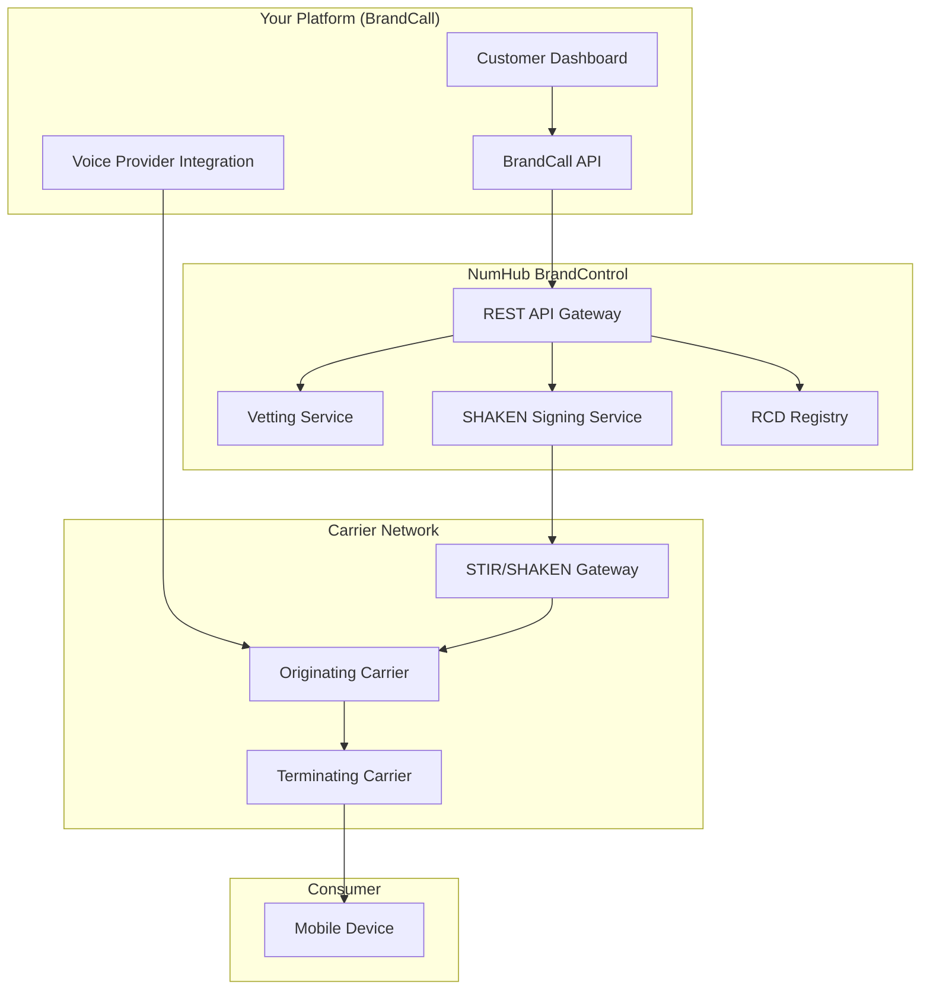
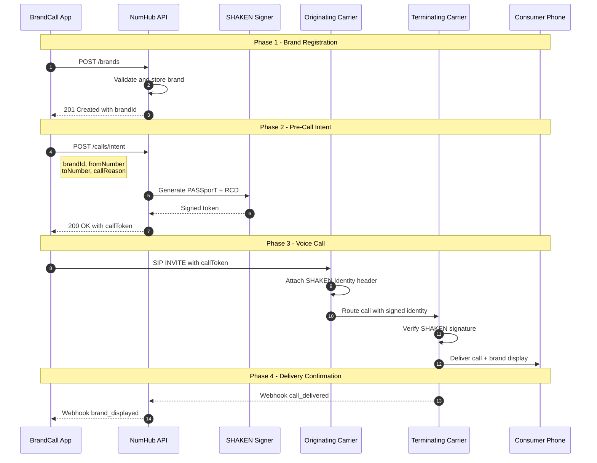
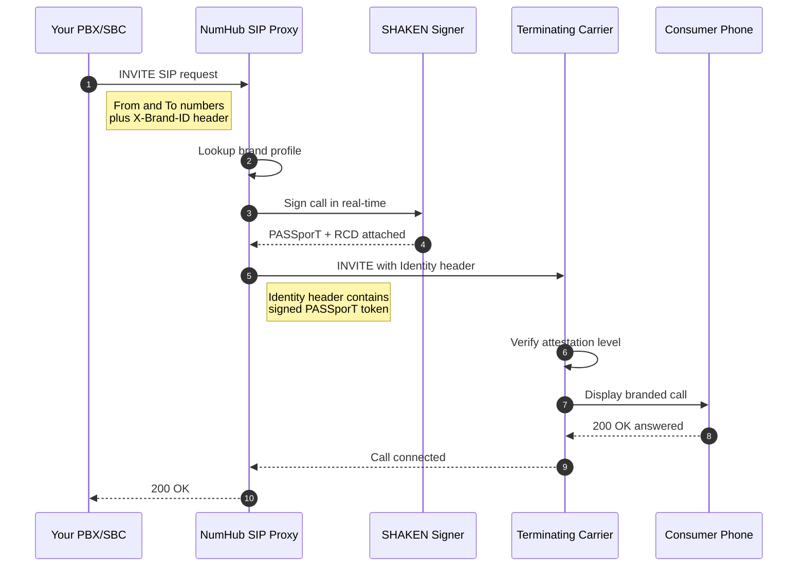
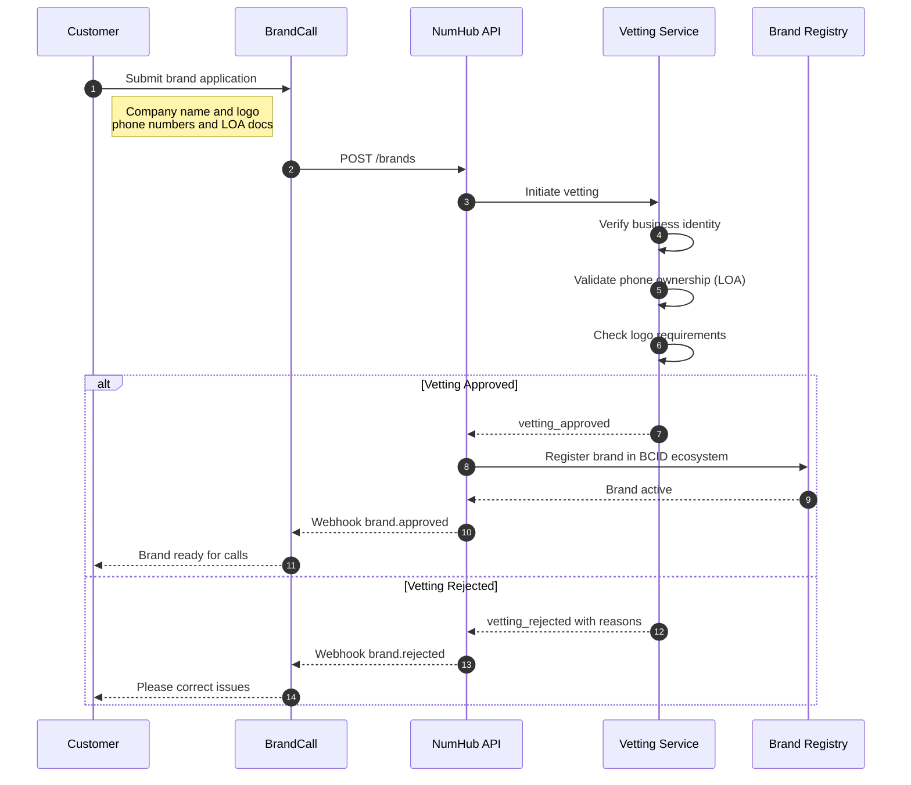
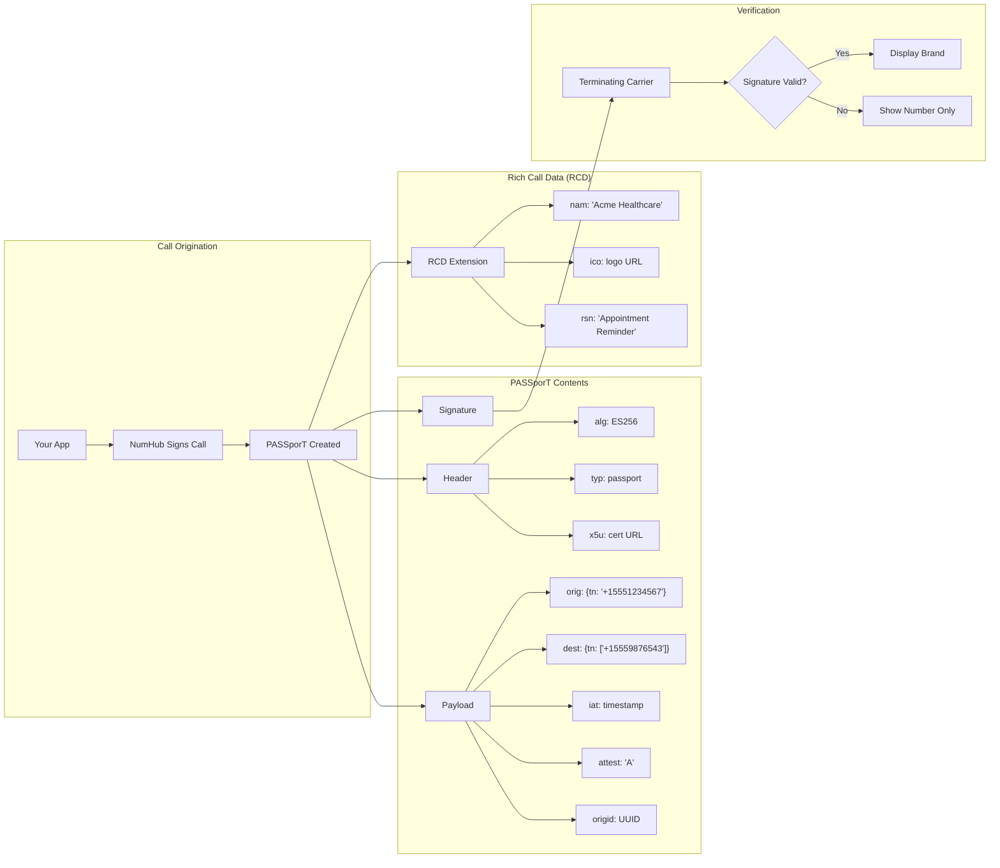
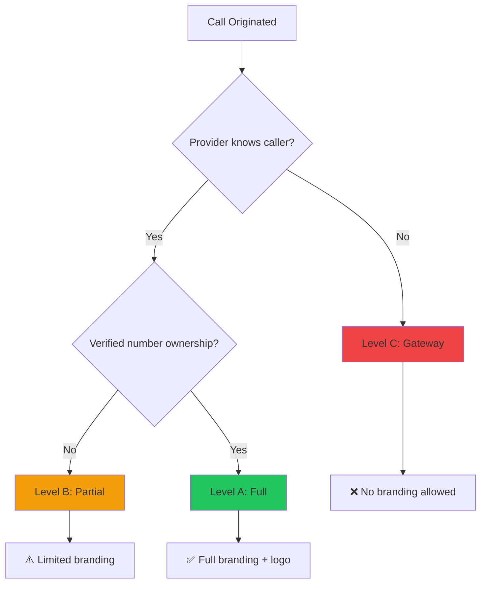
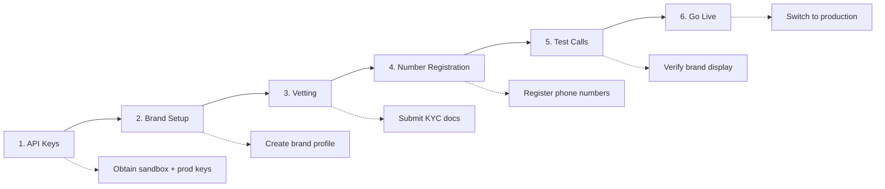

# Branded Caller ID - API Call Flow

> Technical reference for how branded calls are initiated, authenticated, and delivered through the NumHub BrandControl platform.

---

## Overview

Branded Caller ID (BCID) requires coordination between multiple parties to display verified business information on outbound calls. This document describes the API communication flow from call initiation to brand display.

---

## High-Level Architecture



---

## Call Flow Sequence

### Pattern A: Pre-Call Branding (Out-of-Band)

Use this pattern when you can make an API call before initiating the voice call.



### Pattern B: Real-Time Signing (In-Band)

For carriers and high-volume integrations using SIP trunking.



---

## Brand Registration Flow



---

## Event Reference

### Webhook Events

| Event | Trigger | Payload | Use Case |
|:------|:--------|:--------|:---------|
| `brand.created` | Brand submitted | `{brandId, status: "pending"}` | Start onboarding UI |
| `brand.vetting_started` | Vetting begins | `{brandId, estimatedCompletion}` | Show progress |
| `brand.approved` | Vetting passed | `{brandId, status: "active"}` | Enable calling |
| `brand.rejected` | Vetting failed | `{brandId, reasons[], canRetry}` | Show correction needed |
| `brand.suspended` | Policy violation | `{brandId, reason, appealUrl}` | Alert customer |
| `call.intent_created` | Pre-call registered | `{callToken, expiresAt}` | Proceed with call |
| `call.branded` | Brand displayed | `{callId, carrier, attestation}` | Confirm delivery |
| `call.delivered` | Call connected | `{callId, duration, answered}` | Track success |
| `call.failed` | Brand not shown | `{callId, reason, fallback}` | Debug issues |
| `number.flagged` | Spam label detected | `{number, carrier, label}` | Remediation alert |
| `number.cleared` | Label removed | `{number, carrier}` | Confirm fix |

### API Status Codes

| Code | Meaning | Action Required |
|:----:|:--------|:----------------|
| `200` | Success | Process response |
| `201` | Created | Store returned ID |
| `202` | Accepted (async) | Poll or wait for webhook |
| `400` | Bad request | Fix request payload |
| `401` | Unauthorized | Refresh API token |
| `403` | Forbidden | Check permissions/quotas |
| `404` | Not found | Verify resource ID |
| `409` | Conflict | Resource already exists |
| `422` | Validation failed | Check `errors[]` array |
| `429` | Rate limited | Back off, retry later |
| `500` | Server error | Retry with backoff |
| `503` | Service unavailable | Retry later |

---

## API Endpoints

### Brand Management

| Method | Endpoint | Description |
|:-------|:---------|:------------|
| `POST` | `/v1/brands` | Create new brand |
| `GET` | `/v1/brands` | List all brands |
| `GET` | `/v1/brands/{id}` | Get brand details |
| `PATCH` | `/v1/brands/{id}` | Update brand |
| `DELETE` | `/v1/brands/{id}` | Deactivate brand |
| `POST` | `/v1/brands/{id}/logo` | Upload logo |
| `POST` | `/v1/brands/{id}/numbers` | Add phone numbers |
| `DELETE` | `/v1/brands/{id}/numbers/{number}` | Remove number |

### Call Operations

| Method | Endpoint | Description |
|:-------|:---------|:------------|
| `POST` | `/v1/calls/intent` | Register call intent (pre-call) |
| `GET` | `/v1/calls/{id}` | Get call details |
| `GET` | `/v1/calls` | List recent calls |
| `GET` | `/v1/calls/stats` | Call statistics |

### Vetting & Compliance

| Method | Endpoint | Description |
|:-------|:---------|:------------|
| `POST` | `/v1/brands/{id}/vetting` | Submit for vetting |
| `GET` | `/v1/brands/{id}/vetting` | Vetting status |
| `POST` | `/v1/brands/{id}/documents` | Upload KYC document |
| `GET` | `/v1/brands/{id}/compliance` | Compliance status |

### Number Management

| Method | Endpoint | Description |
|:-------|:---------|:------------|
| `GET` | `/v1/numbers` | List registered numbers |
| `GET` | `/v1/numbers/{number}/reputation` | Check spam status |
| `POST` | `/v1/numbers/{number}/remediate` | Request label removal |

---

## Call Intent Request/Response

### Request

```json
POST /v1/calls/intent
Authorization: Bearer {api_key}
Content-Type: application/json

{
  "brandId": "brand_abc123",
  "fromNumber": "+15551234567",
  "toNumber": "+15559876543",
  "callReason": "Appointment Reminder",
  "callReasonCode": "APPT_REMINDER",
  "metadata": {
    "campaignId": "camp_xyz",
    "agentId": "agent_001"
  }
}
```

### Response

```json
{
  "callId": "call_def456",
  "callToken": "eyJhbGciOiJFUzI1NiIs...",
  "expiresAt": "2026-02-04T20:35:00Z",
  "brand": {
    "id": "brand_abc123",
    "displayName": "Acme Healthcare",
    "logoUrl": "https://cdn.numhub.com/logos/abc123.png"
  },
  "attestation": "A",
  "carriers": {
    "tmobile": "supported",
    "verizon": "supported",
    "att": "pending"
  }
}
```

---

## STIR/SHAKEN Identity Flow



---

## Attestation Levels



| Level | Name | Requirements | Brand Display |
|:-----:|:-----|:-------------|:--------------|
| **A** | Full | Provider verified caller identity AND phone number ownership | ✅ Name + Logo + Reason |
| **B** | Partial | Provider knows caller but cannot verify number rights | ⚠️ Name only (no logo) |
| **C** | Gateway | Minimal info (international, unauthenticated) | ❌ No branding |

---

## Error Handling

### Common Error Responses

```json
{
  "error": {
    "code": "BRAND_NOT_ACTIVE",
    "message": "Brand must be active to make branded calls",
    "details": {
      "brandId": "brand_abc123",
      "currentStatus": "pending_vetting",
      "requiredStatus": "active"
    },
    "helpUrl": "https://docs.numhub.com/errors/brand-not-active"
  }
}
```

### Error Codes

| Code | Description | Resolution |
|:-----|:------------|:-----------|
| `BRAND_NOT_FOUND` | Brand ID doesn't exist | Verify brand ID |
| `BRAND_NOT_ACTIVE` | Brand pending or suspended | Complete vetting |
| `NUMBER_NOT_REGISTERED` | Phone number not in brand | Add number to brand |
| `NUMBER_OWNERSHIP_EXPIRED` | LOA needs renewal | Submit new LOA |
| `CALL_REASON_INVALID` | Unrecognized call reason code | Use valid reason code |
| `RATE_LIMIT_EXCEEDED` | Too many requests | Implement backoff |
| `INSUFFICIENT_CREDITS` | Account balance low | Add payment method |
| `CARRIER_NOT_SUPPORTED` | Destination carrier unsupported | Check carrier coverage |

---

## Integration Checklist



| Step | Task | Validation |
|:----:|:-----|:-----------|
| 1 | Obtain API credentials | Can authenticate to sandbox |
| 2 | Create brand profile | Brand ID returned |
| 3 | Submit vetting documents | Status: `vetting_in_progress` |
| 4 | Wait for vetting approval | Status: `active` |
| 5 | Register phone numbers | Numbers associated with brand |
| 6 | Make test branded call | Brand displays on device |
| 7 | Configure webhooks | Events received |
| 8 | Switch to production | Live calls branded |

---

## Rate Limits

| Endpoint | Limit | Window |
|:---------|------:|:-------|
| `POST /brands` | 10 | per hour |
| `POST /calls/intent` | 1,000 | per minute |
| `GET /calls/*` | 100 | per minute |
| `POST /documents` | 50 | per hour |
| Webhooks (outbound) | 10,000 | per minute |

---

## Webhook Security

### Signature Verification

```
X-NumHub-Signature: sha256=abc123...
X-NumHub-Timestamp: 1707076800
```

```python
import hmac
import hashlib

def verify_webhook(payload, signature, timestamp, secret):
    message = f"{timestamp}.{payload}"
    expected = hmac.new(
        secret.encode(),
        message.encode(),
        hashlib.sha256
    ).hexdigest()
    return hmac.compare_digest(f"sha256={expected}", signature)
```

---

*Document Version: 1.0*  
*Last Updated: February 4, 2026*
