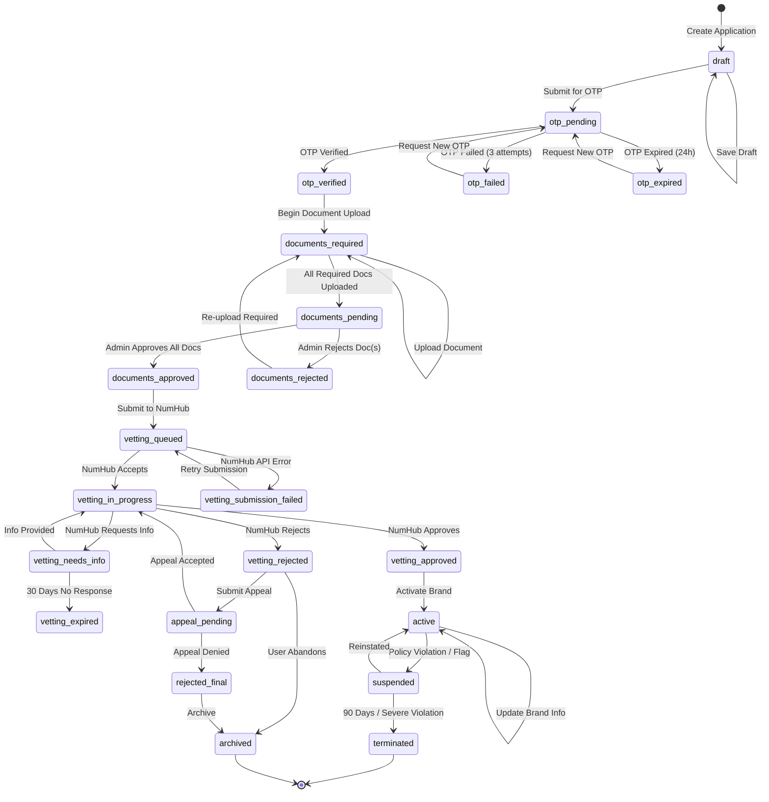
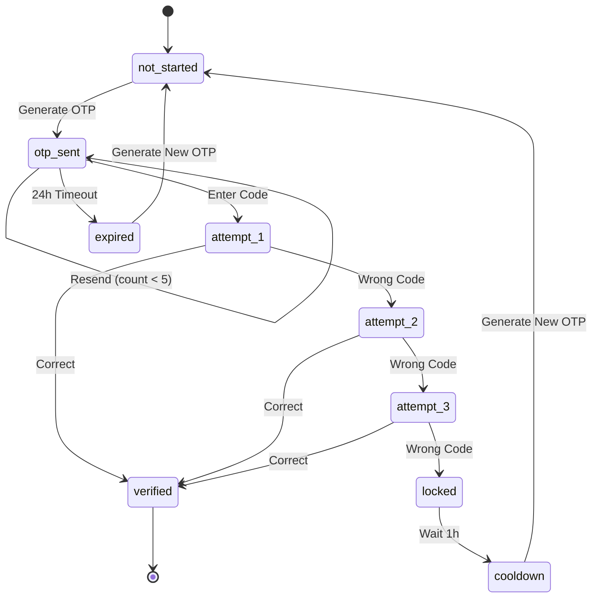
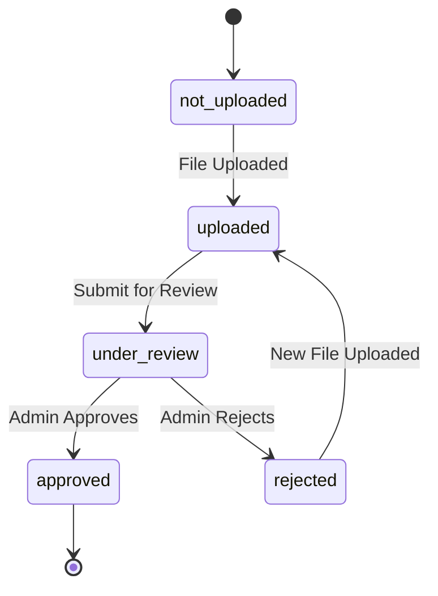
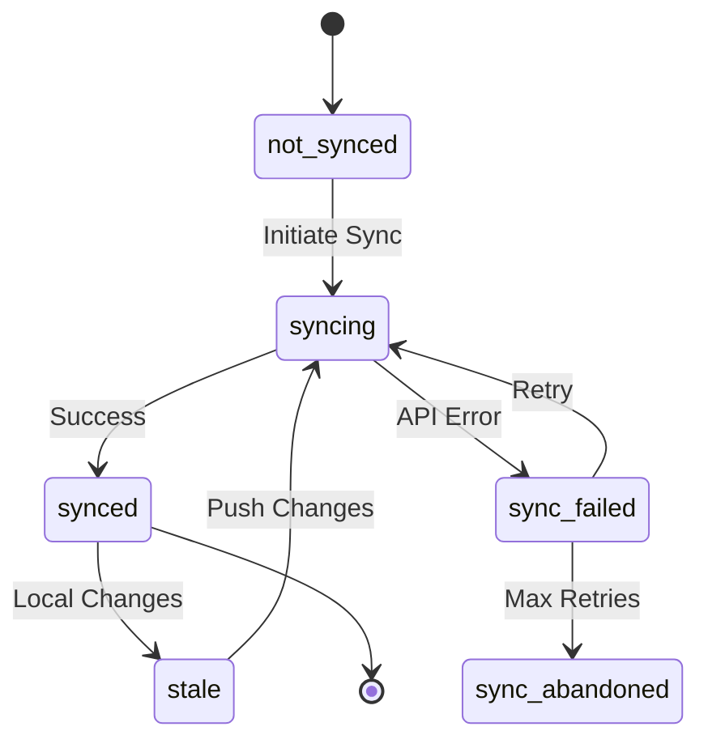

# BCID Application State Machine

> Comprehensive state machine design for managing businesses through the Branded Caller ID application lifecycle.

---

## Table of Contents

1. [Overview](#overview)
2. [State Diagram](#state-diagram)
3. [State Definitions](#state-definitions)
4. [Events & Transitions](#events--transitions)
5. [Sub-State Machines](#sub-state-machines)
6. [Error Handling & Recovery](#error-handling--recovery)
7. [Implementation Plan](#implementation-plan)
8. [Database Schema](#database-schema)
9. [Event/Listener Architecture](#eventlistener-architecture)
10. [Audit Trail](#audit-trail)

---

## Overview

### Purpose

The BCID Application State Machine manages the complete lifecycle of a business applying for Branded Caller ID services. It coordinates:

- **User-driven actions** (form submissions, document uploads)
- **External API callbacks** (NumHub webhooks, OTP verification)
- **Admin interventions** (approval, rejection, flagging)
- **System events** (timeouts, retries, scheduled tasks)

### Design Principles

1. **Single Source of Truth**: The `bcid_applications` table owns the canonical state
2. **Event-Driven**: All transitions trigger events for loose coupling
3. **Audit Everything**: Every transition is logged with before/after state, actor, and timestamp
4. **Recoverable**: Failed API calls can retry; partial completion is tracked
5. **NumHub-Aware**: Local state and NumHub state tracked separately for sync management

---

## State Diagram

### Main Application Flow



### Simplified Linear View

```
┌─────────┐    ┌─────────────┐    ┌───────────────────┐    ┌─────────────────┐    ┌────────────────┐    ┌────────┐
│  DRAFT  │ -> │ OTP_PENDING │ -> │ DOCUMENTS_REQUIRED│ -> │ DOCUMENTS_PENDING│ -> │ VETTING_QUEUED │ -> │ ACTIVE │
└─────────┘    └─────────────┘    └───────────────────┘    └─────────────────┘    └────────────────┘    └────────┘
                                                                    │                      │
                                                                    v                      v
                                                           ┌────────────────┐    ┌────────────────┐
                                                           │DOCUMENTS_REJECTED│   │VETTING_REJECTED│
                                                           └────────────────┘    └────────────────┘
```

---

## State Definitions

### Primary States

| State | Code | Description | Duration | User Action Required |
|-------|------|-------------|----------|---------------------|
| **Draft** | `draft` | Application created, can be edited | No limit | Complete form |
| **OTP Pending** | `otp_pending` | Awaiting phone verification | 24h per OTP | Enter OTP code |
| **OTP Verified** | `otp_verified` | Phone verified, transitional | Instant | Auto-advance |
| **OTP Failed** | `otp_failed` | Max attempts reached | Until retry | Request new OTP |
| **OTP Expired** | `otp_expired` | OTP timed out | Until retry | Request new OTP |
| **Documents Required** | `documents_required` | Awaiting document uploads | 30 days | Upload documents |
| **Documents Pending** | `documents_pending` | Docs uploaded, awaiting review | 5 business days | Wait |
| **Documents Approved** | `documents_approved` | Internal KYC passed, transitional | Instant | Auto-advance |
| **Documents Rejected** | `documents_rejected` | One or more docs rejected | 14 days to fix | Re-upload |
| **Vetting Queued** | `vetting_queued` | Ready for NumHub submission | System processes | Wait |
| **Vetting Submission Failed** | `vetting_submission_failed` | API error during submission | Until retry | Admin action |
| **Vetting In Progress** | `vetting_in_progress` | NumHub reviewing application | 3-5 business days | Wait |
| **Vetting Needs Info** | `vetting_needs_info` | NumHub requested additional info | 30 days | Provide info |
| **Vetting Approved** | `vetting_approved` | NumHub approved, transitional | Instant | Auto-advance |
| **Vetting Rejected** | `vetting_rejected` | NumHub denied application | 14 days to appeal | Appeal or abandon |
| **Appeal Pending** | `appeal_pending` | Appeal submitted to NumHub | 10 business days | Wait |
| **Rejected Final** | `rejected_final` | Appeal denied, no further action | Terminal | None |
| **Active** | `active` | Brand operational, can make calls | Until suspended | Maintain |
| **Suspended** | `suspended` | Temporarily disabled | Until resolved | Resolve issue |
| **Terminated** | `terminated` | Permanently disabled | Terminal | None |
| **Archived** | `archived` | User abandoned application | Terminal | None |

### State Categories

```php
// app/Enums/BcidApplicationStatus.php

enum BcidApplicationStatus: string
{
    // Draft Phase
    case DRAFT = 'draft';
    
    // OTP Verification Phase
    case OTP_PENDING = 'otp_pending';
    case OTP_VERIFIED = 'otp_verified';
    case OTP_FAILED = 'otp_failed';
    case OTP_EXPIRED = 'otp_expired';
    
    // Document Phase
    case DOCUMENTS_REQUIRED = 'documents_required';
    case DOCUMENTS_PENDING = 'documents_pending';
    case DOCUMENTS_APPROVED = 'documents_approved';
    case DOCUMENTS_REJECTED = 'documents_rejected';
    
    // Vetting Phase
    case VETTING_QUEUED = 'vetting_queued';
    case VETTING_SUBMISSION_FAILED = 'vetting_submission_failed';
    case VETTING_IN_PROGRESS = 'vetting_in_progress';
    case VETTING_NEEDS_INFO = 'vetting_needs_info';
    case VETTING_APPROVED = 'vetting_approved';
    case VETTING_REJECTED = 'vetting_rejected';
    
    // Appeal Phase
    case APPEAL_PENDING = 'appeal_pending';
    case REJECTED_FINAL = 'rejected_final';
    
    // Active Phase
    case ACTIVE = 'active';
    case SUSPENDED = 'suspended';
    case TERMINATED = 'terminated';
    
    // Terminal
    case ARCHIVED = 'archived';
    
    // Helper methods
    public function phase(): string
    {
        return match($this) {
            self::DRAFT => 'draft',
            self::OTP_PENDING, self::OTP_VERIFIED, self::OTP_FAILED, self::OTP_EXPIRED => 'otp',
            self::DOCUMENTS_REQUIRED, self::DOCUMENTS_PENDING, self::DOCUMENTS_APPROVED, self::DOCUMENTS_REJECTED => 'documents',
            self::VETTING_QUEUED, self::VETTING_SUBMISSION_FAILED, self::VETTING_IN_PROGRESS, self::VETTING_NEEDS_INFO, self::VETTING_APPROVED, self::VETTING_REJECTED => 'vetting',
            self::APPEAL_PENDING, self::REJECTED_FINAL => 'appeal',
            self::ACTIVE, self::SUSPENDED, self::TERMINATED => 'active',
            self::ARCHIVED => 'archived',
        };
    }
    
    public function isTerminal(): bool
    {
        return in_array($this, [
            self::REJECTED_FINAL,
            self::TERMINATED,
            self::ARCHIVED,
        ]);
    }
    
    public function isActionRequired(): bool
    {
        return in_array($this, [
            self::DRAFT,
            self::OTP_PENDING,
            self::OTP_FAILED,
            self::OTP_EXPIRED,
            self::DOCUMENTS_REQUIRED,
            self::DOCUMENTS_REJECTED,
            self::VETTING_NEEDS_INFO,
            self::VETTING_REJECTED,
        ]);
    }
    
    public function canEdit(): bool
    {
        return in_array($this, [
            self::DRAFT,
            self::OTP_FAILED,
            self::OTP_EXPIRED,
            self::DOCUMENTS_REQUIRED,
            self::DOCUMENTS_REJECTED,
            self::VETTING_NEEDS_INFO,
        ]);
    }
    
    public function label(): string
    {
        return match($this) {
            self::DRAFT => 'Draft',
            self::OTP_PENDING => 'Verifying Phone',
            self::OTP_VERIFIED => 'Phone Verified',
            self::OTP_FAILED => 'Verification Failed',
            self::OTP_EXPIRED => 'Verification Expired',
            self::DOCUMENTS_REQUIRED => 'Documents Required',
            self::DOCUMENTS_PENDING => 'Documents Under Review',
            self::DOCUMENTS_APPROVED => 'Documents Approved',
            self::DOCUMENTS_REJECTED => 'Documents Rejected',
            self::VETTING_QUEUED => 'Submitting to Carrier',
            self::VETTING_SUBMISSION_FAILED => 'Submission Error',
            self::VETTING_IN_PROGRESS => 'Under Carrier Review',
            self::VETTING_NEEDS_INFO => 'Additional Info Required',
            self::VETTING_APPROVED => 'Approved by Carrier',
            self::VETTING_REJECTED => 'Rejected by Carrier',
            self::APPEAL_PENDING => 'Appeal Pending',
            self::REJECTED_FINAL => 'Application Denied',
            self::ACTIVE => 'Active',
            self::SUSPENDED => 'Suspended',
            self::TERMINATED => 'Terminated',
            self::ARCHIVED => 'Archived',
        };
    }
    
    public function color(): string
    {
        return match($this) {
            self::DRAFT => 'gray',
            self::OTP_PENDING, self::OTP_VERIFIED => 'blue',
            self::OTP_FAILED, self::OTP_EXPIRED => 'orange',
            self::DOCUMENTS_REQUIRED => 'blue',
            self::DOCUMENTS_PENDING => 'yellow',
            self::DOCUMENTS_APPROVED => 'green',
            self::DOCUMENTS_REJECTED => 'red',
            self::VETTING_QUEUED, self::VETTING_IN_PROGRESS => 'purple',
            self::VETTING_SUBMISSION_FAILED => 'red',
            self::VETTING_NEEDS_INFO => 'orange',
            self::VETTING_APPROVED => 'green',
            self::VETTING_REJECTED => 'red',
            self::APPEAL_PENDING => 'yellow',
            self::REJECTED_FINAL, self::TERMINATED => 'red',
            self::ACTIVE => 'green',
            self::SUSPENDED => 'orange',
            self::ARCHIVED => 'gray',
        };
    }
}
```

---

## Events & Transitions

### Transition Matrix

```php
// Allowed transitions: [from_state => [allowed_to_states]]
const TRANSITIONS = [
    'draft' => ['otp_pending', 'archived'],
    'otp_pending' => ['otp_verified', 'otp_failed', 'otp_expired'],
    'otp_verified' => ['documents_required'],
    'otp_failed' => ['otp_pending', 'archived'],
    'otp_expired' => ['otp_pending', 'archived'],
    'documents_required' => ['documents_pending', 'archived'],
    'documents_pending' => ['documents_approved', 'documents_rejected'],
    'documents_approved' => ['vetting_queued'],
    'documents_rejected' => ['documents_required', 'archived'],
    'vetting_queued' => ['vetting_in_progress', 'vetting_submission_failed'],
    'vetting_submission_failed' => ['vetting_queued', 'archived'],
    'vetting_in_progress' => ['vetting_approved', 'vetting_rejected', 'vetting_needs_info'],
    'vetting_needs_info' => ['vetting_in_progress', 'vetting_expired', 'archived'],
    'vetting_approved' => ['active'],
    'vetting_rejected' => ['appeal_pending', 'archived'],
    'appeal_pending' => ['vetting_in_progress', 'rejected_final'],
    'rejected_final' => ['archived'],
    'active' => ['suspended', 'active'], // active->active for updates
    'suspended' => ['active', 'terminated'],
    'terminated' => [],
    'archived' => [],
];
```

### Event Definitions

#### User Actions

| Event | Triggered By | From States | To State | Guard Conditions |
|-------|-------------|-------------|----------|------------------|
| `SubmitForOtp` | User clicks "Verify Phone" | `draft` | `otp_pending` | All required fields filled |
| `VerifyOtp` | User enters OTP code | `otp_pending` | `otp_verified` | Valid OTP, not expired |
| `RequestNewOtp` | User requests new OTP | `otp_failed`, `otp_expired` | `otp_pending` | < 5 OTP requests in 24h |
| `UploadDocument` | User uploads file | `documents_required` | (same) | Valid file type/size |
| `SubmitDocuments` | User submits for review | `documents_required` | `documents_pending` | All required docs present |
| `ResubmitDocuments` | User fixes rejected docs | `documents_rejected` | `documents_required` | At least one new upload |
| `ProvideVettingInfo` | User provides requested info | `vetting_needs_info` | `vetting_in_progress` | Info fields completed |
| `SubmitAppeal` | User submits appeal | `vetting_rejected` | `appeal_pending` | Within appeal window |
| `AbandonApplication` | User cancels | Any non-terminal | `archived` | User confirmation |
| `UpdateBrand` | User edits active brand | `active` | `active` | Valid brand data |

#### Admin Actions

| Event | Triggered By | From States | To State | Notes |
|-------|-------------|-------------|----------|-------|
| `ApproveDocument` | Admin in Filament | `documents_pending` | (check all) | Per-document approval |
| `RejectDocument` | Admin in Filament | `documents_pending` | `documents_rejected` | Requires rejection reason |
| `ApproveAllDocuments` | System (all approved) | `documents_pending` | `documents_approved` | Auto-trigger |
| `ForceVettingRetry` | Admin action | `vetting_submission_failed` | `vetting_queued` | Reset retry count |
| `SuspendBrand` | Admin action | `active` | `suspended` | Requires reason |
| `ReinstateBrand` | Admin action | `suspended` | `active` | Issue resolved |
| `TerminateBrand` | Admin action | `suspended` | `terminated` | Severe/repeated violation |

#### API Callbacks (NumHub Webhooks)

| Event | Webhook | From States | To State |
|-------|---------|-------------|----------|
| `NumHubApplicationAccepted` | `application.accepted` | `vetting_queued` | `vetting_in_progress` |
| `NumHubVettingApproved` | `brand.approved` | `vetting_in_progress` | `vetting_approved` |
| `NumHubVettingRejected` | `brand.rejected` | `vetting_in_progress` | `vetting_rejected` |
| `NumHubInfoRequested` | `brand.info_requested` | `vetting_in_progress` | `vetting_needs_info` |
| `NumHubAppealAccepted` | `appeal.accepted` | `appeal_pending` | `vetting_in_progress` |
| `NumHubAppealDenied` | `appeal.denied` | `appeal_pending` | `rejected_final` |
| `NumHubBrandFlagged` | `brand.flagged` | `active` | `suspended` |
| `NumHubBrandCleared` | `brand.cleared` | `suspended` | `active` |

#### System Events (Scheduled)

| Event | Trigger | From States | To State | Schedule |
|-------|---------|-------------|----------|----------|
| `OtpExpired` | Scheduler | `otp_pending` | `otp_expired` | Every 5 min (check 24h) |
| `VettingInfoTimeout` | Scheduler | `vetting_needs_info` | `archived` | Daily (check 30 days) |
| `RetryVettingSubmission` | Scheduler | `vetting_submission_failed` | `vetting_queued` | Every 15 min (max 5 retries) |
| `InactivityArchive` | Scheduler | `draft`, `documents_required` | `archived` | Daily (check 90 days) |
| `SuspensionTimeout` | Scheduler | `suspended` | `terminated` | Daily (check 90 days) |

---

## Sub-State Machines

### OTP Verification Sub-States



**OTP Sub-State Data:**

```php
[
    'otp_status' => 'not_started|sent|verified|locked|expired',
    'otp_code_hash' => string,           // bcrypt hash of 6-digit code
    'otp_sent_at' => timestamp,
    'otp_expires_at' => timestamp,       // sent_at + 24h
    'otp_attempts' => int,               // 0-3
    'otp_resend_count' => int,           // max 5 per 24h
    'otp_locked_until' => timestamp|null,
    'otp_phone_number' => string,        // The number being verified
]
```

### Document Review Sub-States

Each document has its own review state:



**Document Status Aggregation:**

```php
// Aggregate document states to determine application state
function getDocumentPhaseStatus(Application $app): BcidApplicationStatus
{
    $required = $app->getRequiredDocumentTypes();
    $documents = $app->documents;
    
    $allUploaded = $required->every(fn($type) => 
        $documents->where('type', $type)->isNotEmpty()
    );
    
    $allApproved = $required->every(fn($type) => 
        $documents->where('type', $type)->where('status', 'approved')->isNotEmpty()
    );
    
    $anyRejected = $documents->where('status', 'rejected')->isNotEmpty();
    
    if (!$allUploaded) {
        return BcidApplicationStatus::DOCUMENTS_REQUIRED;
    }
    
    if ($anyRejected) {
        return BcidApplicationStatus::DOCUMENTS_REJECTED;
    }
    
    if ($allApproved) {
        return BcidApplicationStatus::DOCUMENTS_APPROVED;
    }
    
    return BcidApplicationStatus::DOCUMENTS_PENDING;
}
```

### NumHub Sync Sub-States

Track synchronization with NumHub API separately:



**NumHub Sync Data:**

```php
[
    'numhub_sync_status' => 'not_synced|syncing|synced|sync_failed|stale',
    'numhub_entity_id' => string|null,       // NumHub's ID for this entity
    'numhub_identity_id' => string|null,     // NumHub's display identity ID
    'numhub_last_synced_at' => timestamp,
    'numhub_last_error' => string|null,
    'numhub_retry_count' => int,
    'numhub_next_retry_at' => timestamp|null,
]
```

---

## Error Handling & Recovery

### Retry Strategy

```php
// config/bcid.php
return [
    'retry' => [
        'numhub_submission' => [
            'max_attempts' => 5,
            'backoff' => 'exponential',  // 1m, 2m, 4m, 8m, 16m
            'max_backoff_minutes' => 60,
        ],
        'otp_generation' => [
            'max_per_day' => 5,
            'cooldown_minutes' => 60,
        ],
        'webhook_processing' => [
            'max_attempts' => 3,
            'backoff' => 'linear',  // 1m, 2m, 3m
        ],
    ],
    'timeouts' => [
        'otp_expiry_hours' => 24,
        'document_review_days' => 5,
        'vetting_info_request_days' => 30,
        'appeal_window_days' => 14,
        'inactivity_archive_days' => 90,
        'suspension_termination_days' => 90,
    ],
];
```

### Error Recovery Patterns

#### 1. Transient API Failures

```php
class SubmitToNumHub
{
    public function handle(BcidApplication $app): void
    {
        try {
            $response = $this->numhub->submitApplication($app);
            $app->transitionTo(BcidApplicationStatus::VETTING_IN_PROGRESS, [
                'numhub_entity_id' => $response['NumhubEntityId'],
            ]);
        } catch (NumHubRateLimitException $e) {
            // Recoverable - schedule retry
            $app->scheduleRetry(minutes: 5);
        } catch (NumHubValidationException $e) {
            // Not recoverable - needs user action
            $app->transitionTo(BcidApplicationStatus::VETTING_SUBMISSION_FAILED, [
                'error' => $e->getMessage(),
                'validation_errors' => $e->errors(),
            ]);
            event(new ApplicationNeedsAttention($app));
        } catch (NumHubServerException $e) {
            // Temporary - exponential backoff
            $app->incrementRetryCount();
            $app->scheduleRetry(
                minutes: min(60, pow(2, $app->numhub_retry_count))
            );
        }
    }
}
```

#### 2. Partial Completion Recovery

```php
class DocumentUploadRecovery
{
    /**
     * Handle interrupted upload sessions.
     * Called on user return to documents page.
     */
    public function recover(BcidApplication $app): void
    {
        // Check for orphaned media library uploads
        $orphanedMedia = Media::where('model_type', Document::class)
            ->whereNull('model_id')
            ->where('custom_properties->application_id', $app->id)
            ->where('created_at', '>', now()->subDay())
            ->get();
        
        foreach ($orphanedMedia as $media) {
            // Attempt to associate with pending document
            $this->associateOrphanedMedia($app, $media);
        }
    }
}
```

#### 3. State Reconciliation

```php
class NumHubStateReconciler
{
    /**
     * Reconcile local state with NumHub when webhooks may have been missed.
     * Run hourly for applications in vetting states.
     */
    public function reconcile(BcidApplication $app): void
    {
        if (!$app->numhub_entity_id) {
            return;
        }
        
        $numhubState = $this->numhub->getApplicationStatus($app->numhub_entity_id);
        $localState = $app->status;
        
        $mapping = [
            'SUBMITTED' => BcidApplicationStatus::VETTING_IN_PROGRESS,
            'APPROVED' => BcidApplicationStatus::VETTING_APPROVED,
            'REJECTED' => BcidApplicationStatus::VETTING_REJECTED,
            'INFO_REQUESTED' => BcidApplicationStatus::VETTING_NEEDS_INFO,
        ];
        
        $expectedLocal = $mapping[$numhubState] ?? null;
        
        if ($expectedLocal && $expectedLocal !== $localState) {
            Log::warning('State mismatch detected', [
                'app_id' => $app->id,
                'local' => $localState->value,
                'numhub' => $numhubState,
                'expected' => $expectedLocal->value,
            ]);
            
            // Auto-correct to NumHub state (source of truth for vetting)
            $app->transitionTo($expectedLocal, [
                'reconciled' => true,
                'previous_state' => $localState->value,
            ]);
        }
    }
}
```

### Manual Override Capability

Admins can force state transitions in exceptional cases:

```php
// In Filament admin panel
Actions\Action::make('forceTransition')
    ->visible(fn () => auth()->user()->hasRole('super-admin'))
    ->form([
        Forms\Components\Select::make('target_state')
            ->options(BcidApplicationStatus::class)
            ->required(),
        Forms\Components\Textarea::make('reason')
            ->required()
            ->minLength(20),
    ])
    ->action(function (BcidApplication $record, array $data) {
        $record->forceTransition(
            BcidApplicationStatus::from($data['target_state']),
            $data['reason'],
            auth()->user()
        );
    });
```

---

## Implementation Plan

### Recommended Package: Custom Implementation

After evaluating options, I recommend a **custom state machine** for BrandCall because:

1. **spatie/laravel-model-states** - Good but limited sub-state support
2. **asantibanez/laravel-eloquent-state-machines** - Abandoned/unmaintained
3. **Custom** - Full control, fits our complex requirements

We'll use a **Trait + Service** pattern:

### Phase 1: Core Infrastructure (Week 1)

#### 1.1 Create Database Migration

```bash
php artisan make:migration create_bcid_applications_table
php artisan make:migration create_bcid_application_transitions_table
```

#### 1.2 Create Enum & Trait

```bash
# Files to create:
app/Enums/BcidApplicationStatus.php      # State enum (shown above)
app/Traits/HasBcidStateMachine.php       # Model trait
app/Services/BcidStateMachine.php        # Transition logic
app/Exceptions/InvalidStateTransition.php
```

#### 1.3 Create Model

```bash
php artisan make:model BcidApplication
```

### Phase 2: Events & Listeners (Week 2)

```bash
# Events
app/Events/BcidApplication/StateTransitioned.php
app/Events/BcidApplication/OtpRequested.php
app/Events/BcidApplication/OtpVerified.php
app/Events/BcidApplication/DocumentsSubmitted.php
app/Events/BcidApplication/VettingSubmitted.php
app/Events/BcidApplication/VettingApproved.php
app/Events/BcidApplication/VettingRejected.php
app/Events/BcidApplication/ApplicationActivated.php

# Listeners
app/Listeners/BcidApplication/SendOtpNotification.php
app/Listeners/BcidApplication/CreateSupportTicket.php
app/Listeners/BcidApplication/NotifyAdmins.php
app/Listeners/BcidApplication/SyncToNumHub.php
app/Listeners/BcidApplication/LogTransition.php
```

### Phase 3: Scheduled Jobs (Week 3)

```bash
# Jobs
app/Jobs/BcidApplication/ProcessOtpExpirations.php
app/Jobs/BcidApplication/RetryVettingSubmissions.php
app/Jobs/BcidApplication/ArchiveInactiveApplications.php
app/Jobs/BcidApplication/ReconcileNumHubStates.php

# Scheduled in app/Console/Kernel.php
```

### Phase 4: Filament Admin (Week 4)

```bash
app/Filament/Resources/BcidApplicationResource.php
app/Filament/Resources/BcidApplicationResource/Pages/*
app/Filament/Widgets/BcidApplicationStats.php
```

### File Structure

```
app/
├── Enums/
│   └── BcidApplicationStatus.php
├── Events/
│   └── BcidApplication/
│       ├── StateTransitioned.php
│       ├── OtpRequested.php
│       ├── OtpVerified.php
│       ├── DocumentsSubmitted.php
│       ├── VettingSubmitted.php
│       ├── VettingApproved.php
│       ├── VettingRejected.php
│       └── ApplicationActivated.php
├── Exceptions/
│   └── InvalidStateTransition.php
├── Jobs/
│   └── BcidApplication/
│       ├── ProcessOtpExpirations.php
│       ├── RetryVettingSubmissions.php
│       ├── ArchiveInactiveApplications.php
│       └── ReconcileNumHubStates.php
├── Listeners/
│   └── BcidApplication/
│       ├── SendOtpNotification.php
│       ├── CreateSupportTicket.php
│       ├── NotifyAdmins.php
│       ├── SyncToNumHub.php
│       └── LogTransition.php
├── Models/
│   ├── BcidApplication.php
│   └── BcidApplicationTransition.php
├── Services/
│   ├── BcidStateMachine.php
│   └── NumHub/
│       └── NumHubApplicationService.php
└── Traits/
    └── HasBcidStateMachine.php
```

---

## Database Schema

### Main Application Table

```php
// database/migrations/xxxx_create_bcid_applications_table.php

Schema::create('bcid_applications', function (Blueprint $table) {
    $table->id();
    $table->foreignId('tenant_id')->constrained()->cascadeOnDelete();
    $table->foreignId('user_id')->constrained()->cascadeOnDelete();
    $table->foreignId('brand_id')->nullable()->constrained()->nullOnDelete();
    
    // State Machine
    $table->string('status')->default('draft')->index();
    $table->string('previous_status')->nullable();
    $table->timestamp('status_changed_at')->nullable();
    
    // Business Information
    $table->string('business_name');
    $table->string('business_type')->nullable(); // LLC, Corp, Sole Prop
    $table->string('ein')->nullable();
    $table->string('business_phone');
    $table->string('business_email');
    $table->string('business_website')->nullable();
    $table->string('business_address');
    $table->string('business_city');
    $table->string('business_state');
    $table->string('business_zip');
    $table->string('business_country')->default('US');
    
    // Display Identity (CNAM/RCD)
    $table->string('display_name', 32); // CNAM limit
    $table->string('call_reason')->nullable();
    $table->string('logo_path')->nullable();
    $table->string('industry')->nullable();
    
    // OTP Verification
    $table->string('otp_phone_number')->nullable();
    $table->string('otp_code_hash')->nullable();
    $table->timestamp('otp_sent_at')->nullable();
    $table->timestamp('otp_expires_at')->nullable();
    $table->tinyInteger('otp_attempts')->default(0);
    $table->tinyInteger('otp_resend_count')->default(0);
    $table->timestamp('otp_locked_until')->nullable();
    $table->timestamp('otp_verified_at')->nullable();
    
    // NumHub Integration
    $table->string('numhub_entity_id')->nullable()->index();
    $table->string('numhub_identity_id')->nullable();
    $table->string('numhub_sync_status')->default('not_synced');
    $table->timestamp('numhub_last_synced_at')->nullable();
    $table->text('numhub_last_error')->nullable();
    $table->tinyInteger('numhub_retry_count')->default(0);
    $table->timestamp('numhub_next_retry_at')->nullable();
    
    // Vetting
    $table->timestamp('vetting_submitted_at')->nullable();
    $table->timestamp('vetting_completed_at')->nullable();
    $table->string('vetting_result')->nullable(); // approved, rejected
    $table->json('vetting_rejection_reasons')->nullable();
    $table->text('vetting_notes')->nullable();
    
    // Appeal
    $table->timestamp('appeal_submitted_at')->nullable();
    $table->text('appeal_reason')->nullable();
    $table->string('appeal_result')->nullable();
    
    // Activation
    $table->timestamp('activated_at')->nullable();
    $table->timestamp('suspended_at')->nullable();
    $table->string('suspension_reason')->nullable();
    $table->timestamp('terminated_at')->nullable();
    $table->string('termination_reason')->nullable();
    
    // Metadata
    $table->json('metadata')->nullable(); // Flexible storage
    $table->timestamps();
    $table->softDeletes();
    
    // Indexes
    $table->index(['tenant_id', 'status']);
    $table->index(['status', 'created_at']);
    $table->index('numhub_sync_status');
});
```

### Transition Audit Log

```php
// database/migrations/xxxx_create_bcid_application_transitions_table.php

Schema::create('bcid_application_transitions', function (Blueprint $table) {
    $table->id();
    $table->foreignId('bcid_application_id')->constrained()->cascadeOnDelete();
    
    $table->string('from_status');
    $table->string('to_status');
    $table->string('event')->nullable(); // What triggered this
    
    // Actor
    $table->string('actor_type')->nullable(); // user, admin, system, webhook
    $table->unsignedBigInteger('actor_id')->nullable();
    $table->string('actor_name')->nullable(); // Denormalized for audit
    
    // Context
    $table->json('context')->nullable(); // Event-specific data
    $table->text('reason')->nullable();  // Human explanation
    $table->string('ip_address')->nullable();
    $table->string('user_agent')->nullable();
    
    $table->timestamp('created_at');
    
    // Indexes
    $table->index(['bcid_application_id', 'created_at']);
    $table->index('to_status');
});
```

### Required Documents Configuration

```php
// database/migrations/xxxx_create_bcid_required_documents_table.php

Schema::create('bcid_required_documents', function (Blueprint $table) {
    $table->id();
    $table->foreignId('bcid_application_id')->constrained()->cascadeOnDelete();
    $table->string('document_type'); // business_license, loa, government_id, etc.
    $table->boolean('is_required')->default(true);
    $table->string('status')->default('not_uploaded'); // not_uploaded, uploaded, approved, rejected
    $table->foreignId('document_id')->nullable()->constrained()->nullOnDelete();
    $table->text('rejection_reason')->nullable();
    $table->foreignId('reviewed_by')->nullable()->constrained('users')->nullOnDelete();
    $table->timestamp('reviewed_at')->nullable();
    $table->timestamps();
    
    $table->unique(['bcid_application_id', 'document_type']);
});
```

---

## Event/Listener Architecture

### Event Provider Registration

```php
// app/Providers/EventServiceProvider.php

protected $listen = [
    // State Transitions
    \App\Events\BcidApplication\StateTransitioned::class => [
        \App\Listeners\BcidApplication\LogTransition::class,
        \App\Listeners\BcidApplication\NotifyUser::class,
    ],
    
    // OTP Events
    \App\Events\BcidApplication\OtpRequested::class => [
        \App\Listeners\BcidApplication\SendOtpNotification::class,
    ],
    \App\Events\BcidApplication\OtpVerified::class => [
        \App\Listeners\BcidApplication\AdvanceToDocuments::class,
    ],
    
    // Document Events
    \App\Events\BcidApplication\DocumentsSubmitted::class => [
        \App\Listeners\BcidApplication\CreateReviewTicket::class,
        \App\Listeners\BcidApplication\NotifyAdmins::class,
    ],
    \App\Events\BcidApplication\DocumentsApproved::class => [
        \App\Listeners\BcidApplication\SubmitToNumHub::class,
    ],
    
    // Vetting Events
    \App\Events\BcidApplication\VettingApproved::class => [
        \App\Listeners\BcidApplication\CreateBrand::class,
        \App\Listeners\BcidApplication\ActivateApplication::class,
        \App\Listeners\BcidApplication\SendApprovalEmail::class,
    ],
    \App\Events\BcidApplication\VettingRejected::class => [
        \App\Listeners\BcidApplication\SendRejectionEmail::class,
        \App\Listeners\BcidApplication\CreateAppealWindow::class,
    ],
];
```

### Example Event Class

```php
// app/Events/BcidApplication/StateTransitioned.php

namespace App\Events\BcidApplication;

use App\Enums\BcidApplicationStatus;
use App\Models\BcidApplication;
use Illuminate\Broadcasting\InteractsWithSockets;
use Illuminate\Foundation\Events\Dispatchable;
use Illuminate\Queue\SerializesModels;

class StateTransitioned
{
    use Dispatchable, InteractsWithSockets, SerializesModels;

    public function __construct(
        public BcidApplication $application,
        public BcidApplicationStatus $from,
        public BcidApplicationStatus $to,
        public string $event,
        public array $context = [],
        public ?int $actorId = null,
        public string $actorType = 'system',
    ) {}
}
```

### Example Listener

```php
// app/Listeners/BcidApplication/LogTransition.php

namespace App\Listeners\BcidApplication;

use App\Events\BcidApplication\StateTransitioned;
use App\Models\BcidApplicationTransition;

class LogTransition
{
    public function handle(StateTransitioned $event): void
    {
        BcidApplicationTransition::create([
            'bcid_application_id' => $event->application->id,
            'from_status' => $event->from->value,
            'to_status' => $event->to->value,
            'event' => $event->event,
            'actor_type' => $event->actorType,
            'actor_id' => $event->actorId,
            'actor_name' => $this->resolveActorName($event),
            'context' => $event->context,
            'ip_address' => request()->ip(),
            'user_agent' => request()->userAgent(),
        ]);
    }
    
    private function resolveActorName(StateTransitioned $event): ?string
    {
        if ($event->actorType === 'user' && $event->actorId) {
            return \App\Models\User::find($event->actorId)?->name;
        }
        if ($event->actorType === 'webhook') {
            return 'NumHub Webhook';
        }
        return $event->actorType;
    }
}
```

### Scheduled Jobs

```php
// app/Console/Kernel.php

protected function schedule(Schedule $schedule): void
{
    // OTP expirations - every 5 minutes
    $schedule->job(new ProcessOtpExpirations)
        ->everyFiveMinutes()
        ->withoutOverlapping();
    
    // Retry failed NumHub submissions - every 15 minutes
    $schedule->job(new RetryVettingSubmissions)
        ->everyFifteenMinutes()
        ->withoutOverlapping();
    
    // Archive inactive drafts - daily at 2am
    $schedule->job(new ArchiveInactiveApplications)
        ->dailyAt('02:00')
        ->withoutOverlapping();
    
    // Reconcile NumHub states - hourly
    $schedule->job(new ReconcileNumHubStates)
        ->hourly()
        ->withoutOverlapping();
    
    // Process vetting info timeouts - daily
    $schedule->job(new ProcessVettingInfoTimeouts)
        ->dailyAt('03:00')
        ->withoutOverlapping();
}
```

---

## Audit Trail

### Viewing Transition History

```php
// In BcidApplication model
public function transitions(): HasMany
{
    return $this->hasMany(BcidApplicationTransition::class)
        ->orderBy('created_at', 'desc');
}

public function getTimelineAttribute(): Collection
{
    return $this->transitions->map(fn ($t) => [
        'date' => $t->created_at,
        'from' => BcidApplicationStatus::from($t->from_status)->label(),
        'to' => BcidApplicationStatus::from($t->to_status)->label(),
        'event' => $t->event,
        'actor' => $t->actor_name ?? 'System',
        'reason' => $t->reason,
    ]);
}
```

### Filament Timeline Widget

```php
// app/Filament/Resources/BcidApplicationResource/Widgets/ApplicationTimeline.php

class ApplicationTimeline extends Widget
{
    public ?BcidApplication $record = null;
    
    protected static string $view = 'filament.widgets.application-timeline';
    
    public function getViewData(): array
    {
        return [
            'transitions' => $this->record->transitions()
                ->with('actor')
                ->take(50)
                ->get(),
        ];
    }
}
```

### Audit Export

```php
// For compliance/legal requests
class AuditExportService
{
    public function exportApplicationHistory(BcidApplication $app): array
    {
        return [
            'application_id' => $app->id,
            'tenant' => $app->tenant->name,
            'current_status' => $app->status->value,
            'created_at' => $app->created_at->toIso8601String(),
            'transitions' => $app->transitions->map(fn ($t) => [
                'timestamp' => $t->created_at->toIso8601String(),
                'from' => $t->from_status,
                'to' => $t->to_status,
                'event' => $t->event,
                'actor_type' => $t->actor_type,
                'actor_id' => $t->actor_id,
                'ip_address' => $t->ip_address,
                'context' => $t->context,
            ])->toArray(),
        ];
    }
}
```

---

## Implementation Timeline

| Week | Focus | Deliverables |
|------|-------|--------------|
| 1 | Core Infrastructure | Migration, Enum, Model, Trait, Service |
| 2 | Events & Listeners | All events, listeners, basic transitions |
| 3 | NumHub Integration | API sync, webhooks, retry logic |
| 4 | Filament Admin | Resource, actions, timeline widget |
| 5 | Frontend (Inertia) | User-facing application flow |
| 6 | Testing & Polish | Feature tests, edge cases, documentation |

---

## References

- [BCID-API-FLOW.md](./BCID-API-FLOW.md) - API communication patterns
- [TODO-NUMHUB-INTEGRATION.md](./TODO-NUMHUB-INTEGRATION.md) - NumHub API tasks
- [NumHub API Docs](https://brandidentity-api.numhub.com/docs/index.html) - External API reference

---

*Document Version: 1.0*  
*Created: 2026-02-04*  
*Author: BrandCall Development Team*
