# NumHub / SmashByte Meeting Brief

> **Meeting**: NumHub BCID Solutions Review w/SmashByte  
> **Date**: Tuesday, February 4, 2026 @ 1:00 PM PST  
> **Platform**: Microsoft Teams  
> **Attendees**: Drew Andersen (NumHub), Sara Hutchinson, Thomas, Brian Grushcow, Jeremy Sarda

---

## Executive Summary

| Item | Details |
|:-----|:--------|
| **What** | NumHub offers white-label BCID infrastructure via their BrandControl platform |
| **Why** | SmashByte wants to "own and operate/enable all of the ecosystem" for Branded Caller ID |
| **Your Role** | Building BrandCall - a BCID SaaS product that would integrate with NumHub |
| **Meeting Tone** | Brian wants this "fully tactical vs informative" - skip the 101, get to deal terms |

---

## How Branded Calling Works

```mermaid
flowchart LR
    subgraph Your Platform
        A[BrandCall App]
    end
    
    subgraph NumHub BrandControl
        B[Vetting & KYC]
        C[SHAKEN Signing]
        D[RCD Attachment]
    end
    
    subgraph Carriers
        E[T-Mobile]
        F[Verizon]
        G[AT&T]
    end
    
    subgraph Consumer
        H[📱 Phone Display]
    end
    
    A -->|Brand Profile + Numbers| B
    B -->|Verified| C
    C -->|Signed Call| D
    D -->|Branded Call| E & F & G
    E & F & G -->|Delivers| H
    
    H -->|Shows| I[✓ Logo]
    H -->|Shows| J[✓ Business Name]
    H -->|Shows| K[✓ Call Reason]
```



---

## BCID Ecosystem Roles


**Key Point**: NumHub handles ALL the complex parts (vetting, signing, carrier relationships). You handle customer acquisition and UX.

---

## STIR/SHAKEN Attestation Levels

| Level | Name | What It Means | BCID Eligible? |
|:-----:|:-----|:--------------|:--------------:|
| **A** | Full Attestation | Provider verifies caller AND their right to use the number | ✅ Required |
| **B** | Partial Attestation | Provider knows caller but can't verify number rights | ❌ No |
| **C** | Gateway Attestation | Minimal info (international/unauthenticated sources) | ❌ No |

> **Bottom Line**: Only Level A calls can display branded information. NumHub's vetting process ensures Level A attestation.

---

## Carrier Coverage


| Carrier | Status | Market Share | Notes |
|:--------|:------:|:------------:|:------|
| **T-Mobile** | ✅ Live | ~35% | Largest BCID deployment |
| **Verizon** | 🚀 Launching | ~30% | Contract signed |
| **AT&T** | ⏳ Expected | ~25% | Following industry trend |
| **Regional** | ⚠️ Varies | ~10% | Mixed support |

---

## Competitor Matrix

| Feature | NumHub | Hiya | First Orion | Numeracle |
|:--------|:------:|:----:|:-----------:|:---------:|
| **Business Model** | White-label platform | Consumer app + B2B | Carrier partnerships | Aggregated platform |
| **STIR/SHAKEN Native** | ✅ | ⚠️ Hybrid | ⚠️ Hybrid | ✅ |
| **App Required** | ❌ | ⚠️ Some features | ❌ | ❌ |
| **White-Label** | ✅ | ❌ | ❌ | ⚠️ Limited |
| **Self-Service API** | ✅ | ❌ | ❌ | ⚠️ |
| **Target Market** | Service providers | Large enterprise | Large enterprise | Mid-market |
| **Min. Commitment** | TBD | ~$25K/yr | ~$50K/yr | ~$10K/yr |

### NumHub's Unique Position


---

## Pricing Intelligence

### Industry Typical Pricing

| Component | Low | Mid | High | Notes |
|:----------|----:|----:|-----:|:------|
| **Platform Fee** | $500/mo | $2,000/mo | $5,000/mo | Per brand/tenant |
| **Per-Call Fee** | $0.02 | $0.04 | $0.08 | Success-based delivery |
| **Vetting/Setup** | $500 | $1,000 | $2,000 | Per brand, annual renewal |
| **Number Registration** | $5/mo | $10/mo | $25/mo | Per phone number |

### Volume Tier Example (Hypothetical)

| Monthly Calls | Per-Call Rate | Platform Fee | Est. Monthly Cost |
|--------------:|--------------:|-------------:|------------------:|
| 10,000 | $0.05 | $1,000 | $1,500 |
| 50,000 | $0.04 | $1,500 | $3,500 |
| 100,000 | $0.03 | $2,000 | $5,000 |
| 500,000 | $0.025 | $3,000 | $15,500 |

---

## Business Impact Data

### The Problem


| Metric | Value | Source |
|:-------|------:|:-------|
| Unidentified calls unanswered | **80%** | Hiya 2025 |
| Consumers who NEVER answer unknown | **48%** | Hiya 2025 |
| Average answer rate (unknown) | **~20%** | Industry avg |

### Branded Calling ROI

| Industry | Metric | Improvement |
|:---------|:-------|------------:|
| Telehealth | Conversion Rate | **+45%** |
| Home Improvement Retail | Decline Rate | **-55%** |
| Property Insurance | Long Call Duration | **+68%** |
| Financial Services | First-Call Conversions | **+76%** |

---

## Questions for the Meeting

### Pricing & Commercial (Priority)

| # | Question | Why It Matters |
|:-:|:---------|:---------------|
| 1 | What's the per-call pricing at volume tiers? | Sets your margin potential |
| 2 | Is there a monthly platform fee? | Fixed cost baseline |
| 3 | What are vetting/onboarding costs per brand? | Customer acquisition cost |
| 4 | Minimum volume commitments? | Risk if you don't hit targets |
| 5 | Revenue share structure? | Long-term economics |

### Technical & Integration

| # | Question | Why It Matters |
|:-:|:---------|:---------------|
| 6 | What's the typical integration timeline? | Time to launch |
| 7 | API architecture - REST? Webhooks? | Dev effort |
| 8 | Sandbox/test environment available? | Development needs |
| 9 | How do you handle LOA verification? | Onboarding flow |
| 10 | SLA for brand display updates? | Customer expectations |

### Strategic

| # | Question | Why It Matters |
|:-:|:---------|:---------------|
| 11 | Why NumHub vs direct carrier enrollment? | Value prop clarity |
| 12 | Exclusivity/non-compete considerations? | Business flexibility |
| 13 | White-label options - full branding? | Customer experience |
| 14 | RCD roadmap (logo, call reason)? | Feature planning |
| 15 | What reporting/analytics included? | Dashboard planning |

---

## Your Position

### What You've Built


| Component | Status | Notes |
|:----------|:------:|:------|
| Multi-tenant architecture | ✅ Ready | TenantScope pattern |
| KYC document collection | ✅ Ready | Spatie Media Library |
| Onboarding flow | ✅ Ready | Pending → Verified → Approved |
| Voice provider abstraction | ✅ Ready | Driver pattern for NumHub |
| Admin panel | ✅ Ready | Filament 3 |
| API credentials | ❌ Blocked | Waiting on NumHub |

### What You Need from NumHub

1. **API credentials** - Complete integration
2. **Sandbox environment** - Testing
3. **Clear pricing** - Set your margins
4. **Technical docs** - API reference
5. **Vetting workflow specs** - Match your onboarding

---

## Deal Terms to Watch

| Term | Risk | What to Negotiate |
|:-----|:-----|:------------------|
| **Volume minimums** | Too high for early stage | Start low, ramp up |
| **Exclusivity** | Limits your options | Non-exclusive or time-limited |
| **Hidden costs** | Vetting renewals, number fees | All-in pricing |
| **Contract length** | Lock-in risk | 1 year max initially |
| **SLA penalties** | Carrier issues aren't your fault | Reasonable exceptions |

---

## Quick Reference Glossary

| Term | Definition |
|:-----|:-----------|
| **BCID** | Branded Calling ID - CTIA-governed ecosystem |
| **RCD** | Rich Call Data - logo + name + call reason |
| **CNAM** | Caller Name - 15-32 character display |
| **OSP** | Originating Service Provider |
| **TSP** | Terminating Service Provider |
| **PASSporT** | Personal Assertion Token - crypto signature |
| **LOA** | Letter of Authorization - number ownership proof |
| **VPU** | Voice Pick Up - answer rate metric |

---

## One-Page Cheat Sheet

```
┌─────────────────────────────────────────────────────────────────┐
│                    MEETING CHEAT SHEET                         │
├─────────────────────────────────────────────────────────────────┤
│                                                                 │
│  NUMHUB = White-label BCID infrastructure                      │
│  • They handle: vetting, signing, carrier relationships        │
│  • You handle: customers, pricing, UX                          │
│                                                                 │
├─────────────────────────────────────────────────────────────────┤
│                                                                 │
│  TOP 5 QUESTIONS:                                               │
│  1. Per-call pricing at volume tiers?                          │
│  2. Platform fee?                                               │
│  3. Minimum commitments?                                        │
│  4. API access / sandbox timeline?                              │
│  5. White-label flexibility?                                    │
│                                                                 │
├─────────────────────────────────────────────────────────────────┤
│                                                                 │
│  KEY STATS:                                                     │
│  • 80% of unknown calls unanswered                              │
│  • Branded calling = +45-76% conversion lift                    │
│  • Only 5K of 32M US businesses use this                        │
│                                                                 │
├─────────────────────────────────────────────────────────────────┤
│                                                                 │
│  YOUR LEVERAGE:                                                 │
│  • Working platform ready to integrate                          │
│  • Go-to-market strategy (SMB, self-service)                   │
│  • Technical capacity to ship fast                              │
│                                                                 │
└─────────────────────────────────────────────────────────────────┘
```

---

*Prepared: February 4, 2026 | For: Jeremy Sarda | Meeting: 1:00 PM PST*
