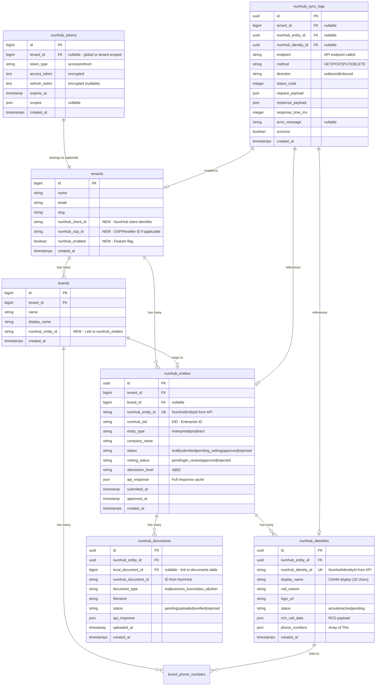

# NumHub BrandControl - Database Schema Design

> **Purpose**: Database schema for integrating with NumHub BrandControl API  
> **Date**: 2026-02-04  
> **Status**: Draft - Migrations created but NOT run

---

## Overview

This document describes the database schema additions needed to integrate BrandCall with the NumHub BrandControl API. The design follows existing patterns in the codebase and supports:

- **OAuth Token Caching** - Store and auto-refresh NumHub access tokens
- **Entity Mapping** - Link BrandCall businesses to NumHub BCID applications
- **Identity Mapping** - Track phone number display identities
- **Document Tracking** - Sync uploaded documents with NumHub
- **Audit Trail** - Log all API interactions for debugging and compliance

---

## ER Diagram



---

## Table Definitions

### 1. `numhub_tokens` - OAuth Token Cache

Stores NumHub API access tokens with automatic expiry tracking.

| Column | Type | Constraints | Description |
|--------|------|-------------|-------------|
| `id` | bigint | PK, auto | Primary key |
| `tenant_id` | bigint | FK nullable | Null = global token, set = tenant-specific |
| `token_type` | varchar(20) | not null | `access` or `refresh` |
| `access_token` | text | not null, encrypted | The bearer token |
| `refresh_token` | text | nullable, encrypted | For token refresh (if supported) |
| `expires_at` | timestamp | not null | Token expiration time |
| `scopes` | json | nullable | Granted API scopes |
| `created_at` | timestamp | | |
| `updated_at` | timestamp | | |

**Indexes:**
- `tenant_id` (allows null for global tokens)
- `expires_at` (for cleanup queries)

**Usage:**
```php
// Get valid token (auto-refresh if needed)
$token = NumHubToken::getValidToken($tenantId);
```

---

### 2. `numhub_entities` - BCID Application Mapping

Maps BrandCall tenants/brands to NumHub BCID applications (NumhubEntityId).

| Column | Type | Constraints | Description |
|--------|------|-------------|-------------|
| `id` | uuid | PK | UUID primary key |
| `tenant_id` | bigint | FK, not null | Owning tenant |
| `brand_id` | bigint | FK, nullable | Associated brand (optional) |
| `numhub_entity_id` | varchar(100) | unique, not null | NumHub's entity identifier |
| `numhub_eid` | varchar(50) | nullable | Enterprise ID (EID) |
| `entity_type` | varchar(20) | not null | `enterprise`, `bpo`, `direct` |
| `company_name` | varchar(255) | not null | Business name submitted |
| `status` | varchar(30) | not null | Our internal status tracking |
| `vetting_status` | varchar(30) | not null | NumHub vetting state |
| `attestation_level` | char(1) | nullable | STIR/SHAKEN level (A/B/C) |
| `api_response` | json | nullable | Full API response cache |
| `submitted_at` | timestamp | nullable | When submitted to NumHub |
| `approved_at` | timestamp | nullable | When approved by NumHub |
| `created_at` | timestamp | | |
| `updated_at` | timestamp | | |

**Indexes:**
- `numhub_entity_id` (unique)
- `tenant_id, status` (compound)
- `brand_id`

**Status Flow:**
```
draft → submitted → pending_vetting → approved
                                    → rejected
```

---

### 3. `numhub_identities` - Display Identity Mapping

Tracks caller ID display configurations (NumhubIdentityId).

| Column | Type | Constraints | Description |
|--------|------|-------------|-------------|
| `id` | uuid | PK | UUID primary key |
| `numhub_entity_id` | uuid | FK, not null | Parent entity |
| `numhub_identity_id` | varchar(100) | unique, not null | NumHub's identity ID |
| `display_name` | varchar(32) | not null | CNAM display text |
| `call_reason` | varchar(255) | nullable | Default call reason |
| `logo_url` | varchar(500) | nullable | Logo URL in NumHub |
| `status` | varchar(20) | not null | `active`, `inactive`, `pending` |
| `rich_call_data` | json | nullable | Full RCD configuration |
| `phone_numbers` | json | nullable | Array of associated TNs |
| `created_at` | timestamp | | |
| `updated_at` | timestamp | | |

**Indexes:**
- `numhub_identity_id` (unique)
- `numhub_entity_id, status` (compound)

---

### 4. `numhub_documents` - Document Tracking

Tracks documents uploaded to NumHub for verification.

| Column | Type | Constraints | Description |
|--------|------|-------------|-------------|
| `id` | uuid | PK | UUID primary key |
| `numhub_entity_id` | uuid | FK, not null | Associated entity |
| `local_document_id` | bigint | FK, nullable | Link to `documents` table |
| `numhub_document_id` | varchar(100) | nullable | NumHub's document ID |
| `document_type` | varchar(50) | not null | loa, business_license, etc. |
| `filename` | varchar(255) | not null | Original filename |
| `status` | varchar(20) | not null | Upload/verification status |
| `api_response` | json | nullable | NumHub's response |
| `uploaded_at` | timestamp | nullable | When uploaded to NumHub |
| `created_at` | timestamp | | |
| `updated_at` | timestamp | | |

**Indexes:**
- `numhub_entity_id`
- `local_document_id`
- `status`

---

### 5. `numhub_sync_logs` - API Audit Trail

Records all API interactions for debugging and compliance.

| Column | Type | Constraints | Description |
|--------|------|-------------|-------------|
| `id` | uuid | PK | UUID primary key |
| `tenant_id` | bigint | FK, nullable | Associated tenant |
| `numhub_entity_id` | uuid | FK, nullable | Related entity |
| `numhub_identity_id` | uuid | FK, nullable | Related identity |
| `endpoint` | varchar(255) | not null | API endpoint path |
| `method` | varchar(10) | not null | HTTP method |
| `direction` | varchar(10) | not null | `outbound` or `inbound` (webhook) |
| `status_code` | smallint | nullable | HTTP response code |
| `request_payload` | json | nullable | What we sent (redacted) |
| `response_payload` | json | nullable | What we received |
| `response_time_ms` | int | nullable | API response time |
| `error_message` | text | nullable | Error details if failed |
| `success` | boolean | not null | Quick filter flag |
| `created_at` | timestamp | | |

**Indexes:**
- `tenant_id, created_at` (compound, for tenant queries)
- `endpoint, success` (compound, for debugging)
- `created_at` (for cleanup/retention)

**Note:** Logs are write-heavy. Consider partitioning by date in production or setting up auto-cleanup after 90 days.

---

### 6. `tenants` Table Additions

New columns added to existing `tenants` table:

| Column | Type | Constraints | Description |
|--------|------|-------------|-------------|
| `numhub_client_id` | varchar(100) | nullable | NumHub client identifier |
| `numhub_osp_id` | varchar(100) | nullable | OSP/Reseller ID (if applicable) |
| `numhub_enabled` | boolean | default false | Feature flag for NumHub integration |

---

## Relationships Summary

```
Tenant (existing)
├── has many → NumHubEntity (via tenant_id)
├── has many → NumHubToken (via tenant_id, nullable)
├── has many → NumHubSyncLog (via tenant_id)
└── has many → Brand (existing)
    └── belongs to → NumHubEntity (optional 1:1)

NumHubEntity
├── belongs to → Tenant
├── belongs to → Brand (optional)
├── has many → NumHubIdentity
├── has many → NumHubDocument
└── has many → NumHubSyncLog

NumHubIdentity
├── belongs to → NumHubEntity
└── has many → NumHubSyncLog

NumHubDocument
├── belongs to → NumHubEntity
└── belongs to → Document (local, optional)
```

---

## Migration Files

Created in `/database/migrations/`:

1. `2026_02_04_140000_create_numhub_tokens_table.php`
2. `2026_02_04_140001_create_numhub_entities_table.php`
3. `2026_02_04_140002_create_numhub_identities_table.php`
4. `2026_02_04_140003_create_numhub_documents_table.php`
5. `2026_02_04_140004_create_numhub_sync_logs_table.php`
6. `2026_02_04_140005_add_numhub_fields_to_tenants_table.php`

---

## Model Files

Created in `/app/Models/NumHub/`:

1. `NumHubToken.php` - Token management with auto-refresh
2. `NumHubEntity.php` - BCID application mapping
3. `NumHubIdentity.php` - Display identity tracking
4. `NumHubDocument.php` - Document sync tracking
5. `NumHubSyncLog.php` - API audit logging

---

## Data Flow Examples

### Creating a BCID Application

```php
// 1. Create local entity record
$entity = NumHubEntity::create([
    'tenant_id' => $tenant->id,
    'brand_id' => $brand->id,
    'numhub_entity_id' => $response['NumhubEntityId'],
    'entity_type' => 'enterprise',
    'company_name' => $brand->name,
    'status' => 'submitted',
    'vetting_status' => 'pending',
]);

// 2. Log the API call
NumHubSyncLog::create([
    'tenant_id' => $tenant->id,
    'numhub_entity_id' => $entity->id,
    'endpoint' => '/api/v1/application',
    'method' => 'POST',
    'direction' => 'outbound',
    'status_code' => 200,
    'request_payload' => $sanitizedRequest,
    'response_payload' => $response,
    'success' => true,
]);
```

### Syncing Identity Updates

```php
// Webhook handler or polling job
$identity = NumHubIdentity::where('numhub_identity_id', $webhookData['id'])->first();
$identity->update([
    'status' => $webhookData['status'],
    'rich_call_data' => $webhookData['rcd'],
]);
```

---

## Security Considerations

1. **Token Encryption**: `access_token` and `refresh_token` are stored encrypted using Laravel's `encrypted` cast
2. **Payload Redaction**: Sensitive fields (passwords, tokens) must be redacted before logging to `numhub_sync_logs`
3. **Tenant Isolation**: All queries automatically scoped by `tenant_id` where applicable
4. **Audit Retention**: Configure cleanup policy for `numhub_sync_logs` (recommend 90 days)

---

## Next Steps

1. [ ] Run migrations: `php artisan migrate`
2. [ ] Create NumHubClient service class
3. [ ] Implement token refresh logic in NumHubToken model
4. [ ] Add webhook endpoints for NumHub callbacks
5. [ ] Create Filament admin pages for monitoring

---

*Last updated: 2026-02-04*
