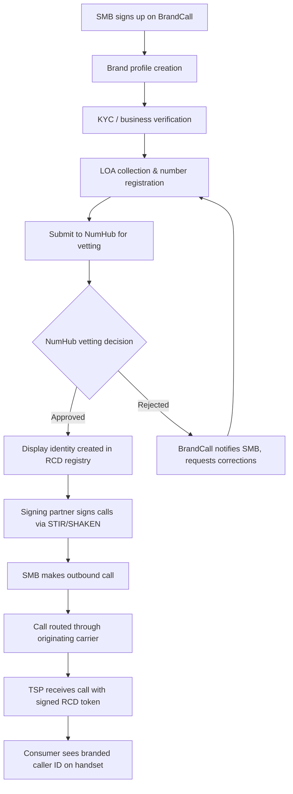
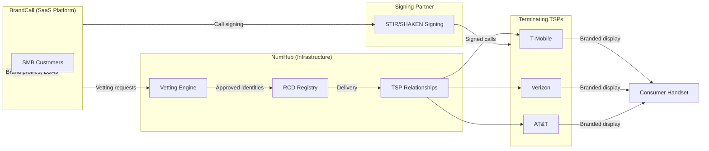
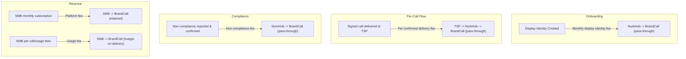

# BrandCall + NumHub: Customer Flow & Ecosystem Workflow

**Prepared for:** Brian, NumHub
**Date:** February 10, 2026
**From:** Jeremy Sarda, BrandCall.io

---

## 1. Executive Summary

Brian -- thanks for the clear ask. Below is our view of how customers flow through the ecosystem, from SMB signup on BrandCall through to branded call delivery on consumer handsets. We've mapped roles, touchpoints, and fee layers so we can align on where costs sit and where margin lives.

Key points up front:
- BrandCall owns the SMB relationship (acquisition, onboarding, billing, support)
- NumHub provides the BCID infrastructure (vetting, RCD registry, TSP delivery)
- A signing partner (introduction via NumHub) handles call signing/attestation
- TSPs are the terminating display layer

We're ready to discuss pricing assumptions and margin flexibility once you've reviewed the flow.

---

## 2. Customer Flow Diagram

### End-to-End Onboarding Flow

### Ecosystem Relationship Map

---

## 3. Roles & Responsibilities

| Function | BrandCall | NumHub | Signing Partner | TSPs |
|---|---|---|---|---|
| **SMB acquisition & sales** | Owner | -- | -- | -- |
| **SMB onboarding & support** | Owner | -- | -- | -- |
| **Brand profile & KYC collection** | Owner | -- | -- | -- |
| **LOA collection & number registration** | Owner | -- | -- | -- |
| **Business vetting** | Submits | Performs | -- | -- |
| **RCD registry management** | -- | Owner | -- | -- |
| **TSP relationships & delivery** | -- | Owner | -- | -- |
| **Call signing (STIR/SHAKEN)** | Integrates | Facilitates intro | Performs | -- |
| **Branded display on handset** | -- | -- | -- | Performs |
| **SMB billing** | Owner | -- | -- | -- |
| **Compliance monitoring** | Shared | Shared | -- | Reports |
| **Non-compliance enforcement** | Notifies SMB | Assesses fee | -- | Reports violations |

---

## 4. Touchpoints & Fee Structure

### Fee Map by Touchpoint

### Fee Structure Detail

| Fee Type | Trigger | Paid By | Paid To | BrandCall Treatment |
|---|---|---|---|---|
| **Monthly display identity fee** | Per active display identity, monthly | BrandCall | NumHub | Pass-through, bundled into SMB subscription |
| **Per confirmed delivery fee** | Each confirmed branded call delivery to TSP | BrandCall | NumHub | Pass-through with margin, billed as usage to SMB |
| **Non-compliance fee** | Violation reported and confirmed | BrandCall | NumHub | Pass-through to offending SMB customer |
| **Signing fees** | Per-call or monthly (TBD with partner) | BrandCall | Signing Partner | Pass-through, bundled into usage pricing |

---

## 5. Pricing Model Proposal

### Cost Stack (Per SMB Customer)

| Line Item | Estimated Cost (NumHub) | BrandCall Retail Price | Margin |
|---|---|---|---|
| **Monthly display identity fee** | $X/identity/month (TBD) | Bundled in subscription | Subscription minus pass-through |
| **Per confirmed delivery fee** | $X.XXX/delivery (TBD) | $0.XX/branded call | Spread per call |
| **Non-compliance fee** | $X per incident (TBD) | Passed through at cost | $0 (pass-through) |
| **Signing (via partner)** | TBD | Bundled in per-call rate | Included in call margin |

### BrandCall Retail Pricing (Proposed Tiers)

| Plan | Monthly Fee | Included Branded Calls | Overage Rate |
|---|---|---|---|
| **Starter** | $49/mo | 500 calls | $0.08/call |
| **Professional** | $149/mo | 2,000 calls | $0.06/call |
| **Business** | $349/mo | 6,000 calls | $0.04/call |
| **Enterprise** | Custom | Custom | Custom |

Each plan includes: 1 display identity, brand profile management, analytics dashboard, compliance monitoring.
Additional display identities: $XX/mo each (pass-through + margin).

### Margin Analysis

| Revenue Source | Type | Notes |
|---|---|---|
| **Monthly subscription** | Retained | Covers platform costs, support, display identity pass-through |
| **Per-call spread** | Margin on usage | Difference between retail per-call rate and NumHub + signing costs |
| **Additional display identities** | Margin on pass-through | Markup over NumHub per-identity fee |
| **Non-compliance fees** | Pass-through | No margin -- passed to SMB at cost |

---

## 6. Open Questions for Alignment

1. **NumHub fee schedule** -- Can you share current or indicative rates for monthly display identity fees and per-delivery fees? Even ranges help us model.
2. **Signing partner introduction** -- Ready to connect whenever convenient. Do you have a preferred partner?
3. **Volume thresholds** -- Are there volume-based tiers on NumHub's side that affect per-delivery pricing?
4. **Non-compliance process** -- What does the reporting and confirmation workflow look like? Who adjudicates?
5. **TSP coverage** -- Which TSPs are currently active for RCD delivery? Timeline for others?

---

*Ready to walk through this on a call or iterate async. Let us know what works.*
