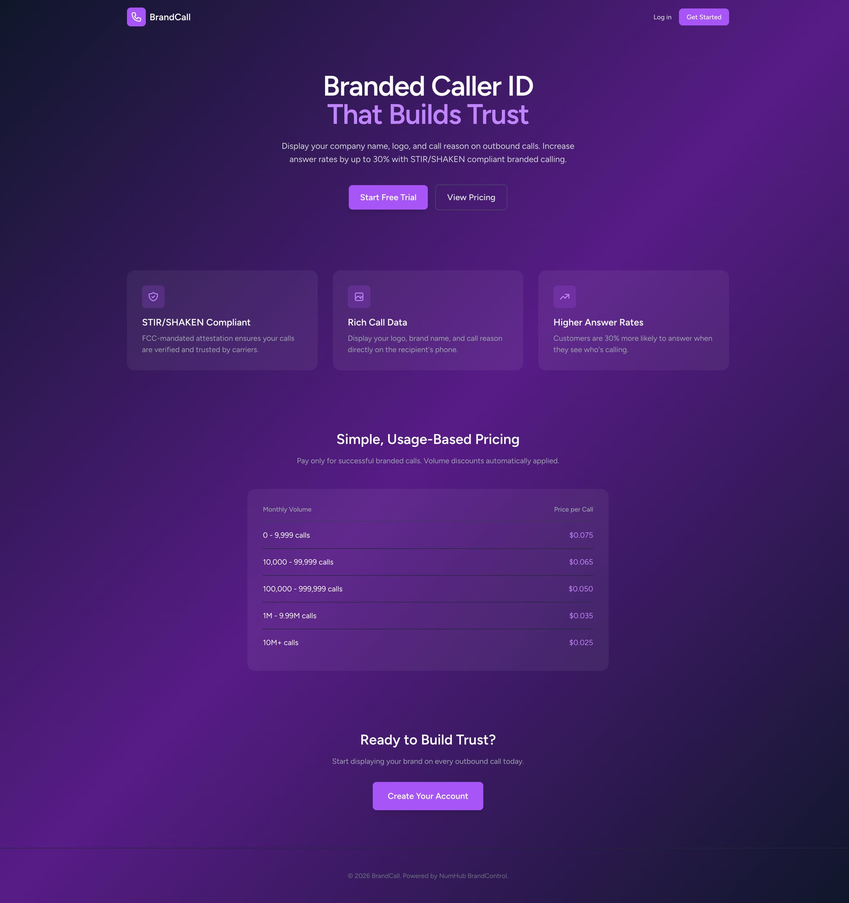
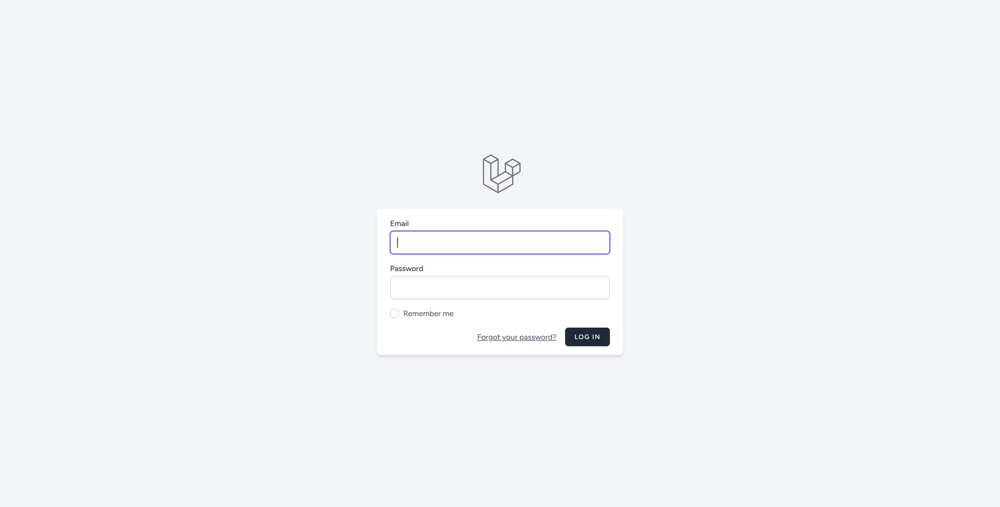
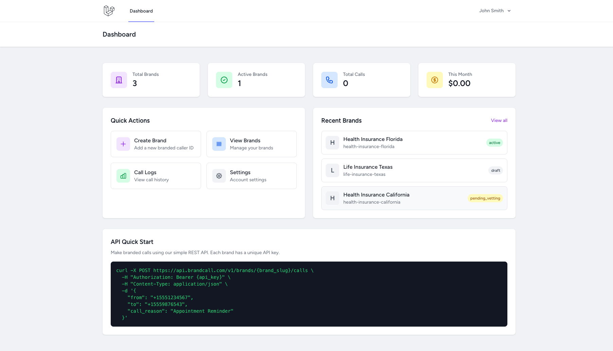
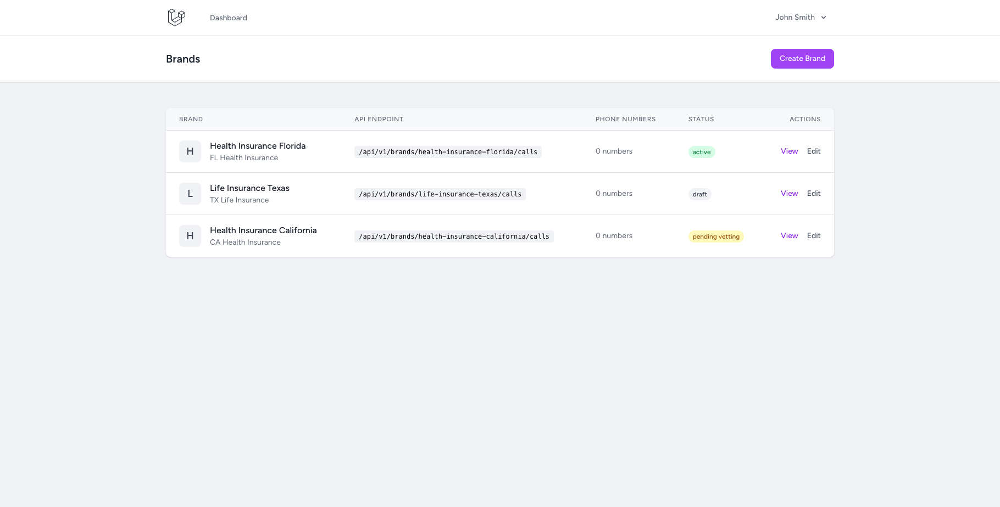
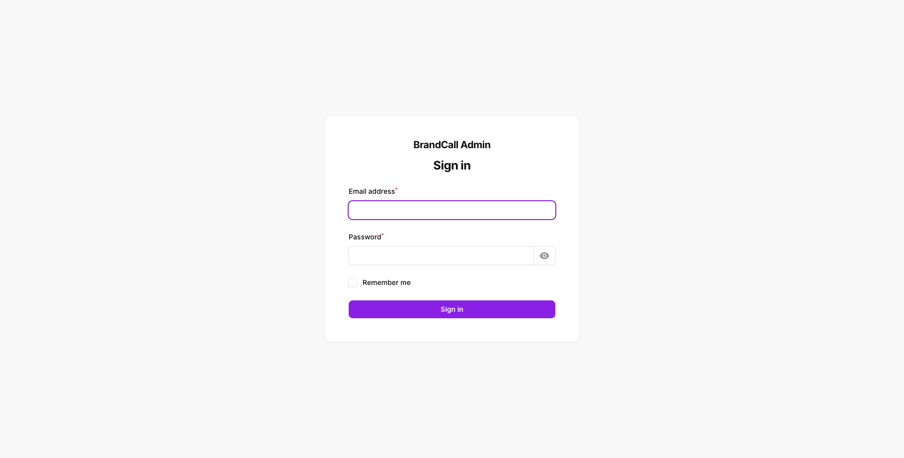
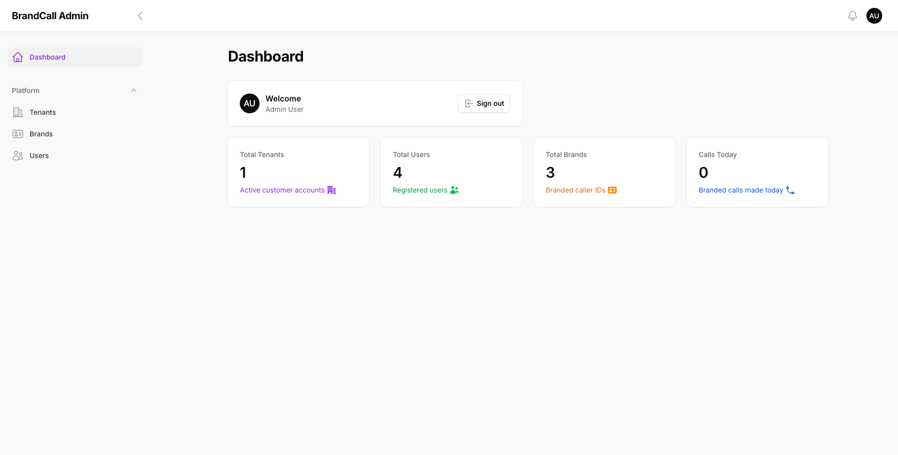
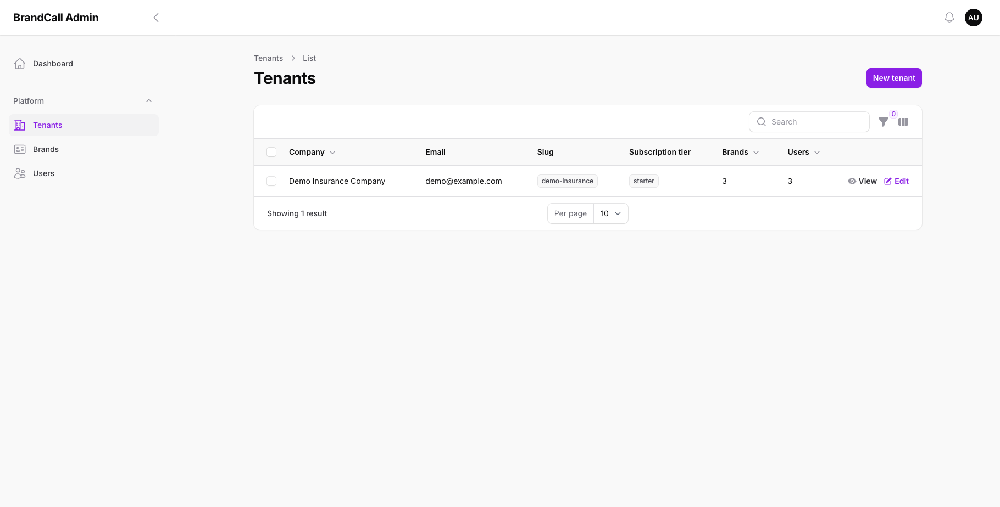
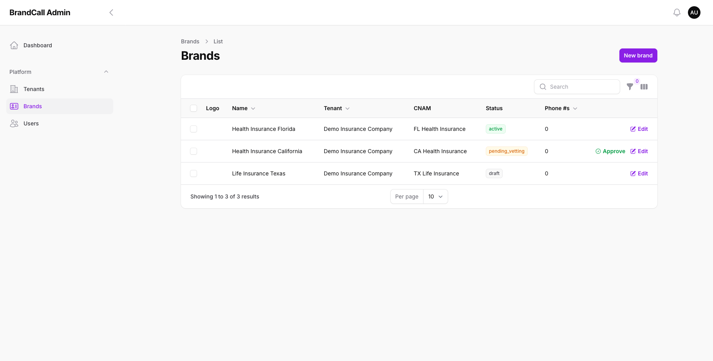
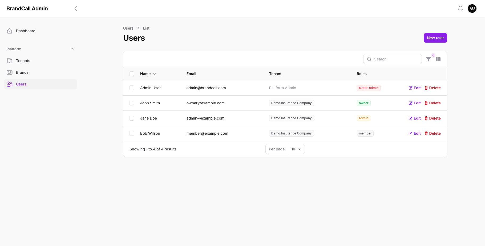

# BrandCall User Guide

Complete guide to using the BrandCall Branded Caller ID Platform.

## Table of Contents

1. [Overview](#overview)
2. [Getting Started](#getting-started)
3. [Customer Dashboard](#customer-dashboard)
4. [Managing Brands](#managing-brands)
5. [Admin Panel](#admin-panel)
6. [API Integration](#api-integration)
7. [Roles & Permissions](#roles--permissions)

---

## Overview

BrandCall allows businesses to display their company name, logo, and call reason on outbound calls. This increases answer rates by up to 30% by building trust with call recipients.

### Key Features

- **Branded Caller ID**: Display your business name and logo
- **Rich Call Data (RCD)**: Show call reason on supported devices
- **STIR/SHAKEN Compliant**: FCC-mandated call authentication
- **Multi-tenant**: Isolated workspaces for each customer
- **Role-based Access**: Granular permissions for team members

---

## Getting Started

### Homepage



The public homepage showcases:
- **Value proposition**: "Branded Caller ID That Builds Trust"
- **Feature highlights**: STIR/SHAKEN compliance, Rich Call Data, Higher Answer Rates
- **Pricing table**: Volume-based pricing from $0.075 to $0.025 per call
- **Call-to-action**: Start Free Trial / Get Started buttons

### Registration & Login



- Navigate to `/login` to sign in
- Use `/register` to create a new account
- Password reset available via "Forgot your password?"

---

## Customer Dashboard

After logging in as a customer (tenant user), you'll see the main dashboard.



### Dashboard Components

1. **Stats Cards** (top row):
   - **Total Brands**: Number of branded caller IDs created
   - **Active Brands**: Brands approved and ready for calls
   - **Total Calls**: Lifetime call count
   - **This Month**: Current month's spending

2. **Quick Actions** (left):
   - Create Brand
   - View Brands
   - Call Logs
   - Settings

3. **Recent Brands** (right):
   - Shows your 5 most recent brands
   - Status badges: `active` (green), `pending_vetting` (yellow), `draft` (gray)
   - Quick links to view each brand

4. **API Quick Start** (bottom):
   - Sample cURL command for making branded calls
   - Shows the API endpoint structure

---

## Managing Brands

### Brands List



The brands list shows all your branded caller IDs:

| Column | Description |
|--------|-------------|
| **Brand** | Name and display name (CNAM) |
| **API Endpoint** | The URL to make calls for this brand |
| **Phone Numbers** | Count of associated phone numbers |
| **Status** | Current approval status |
| **Actions** | View and Edit buttons |

### Brand Statuses

- **draft**: Initial state, not submitted for approval
- **pending_vetting**: Submitted and awaiting admin approval
- **active**: Approved and ready for branded calls
- **suspended**: Disabled (e.g., compliance violation)

### Creating a Brand


To create a new brand:

1. Click **Create Brand** button
2. Fill in the form:
   - **Brand Name** (required): Internal name for your reference
   - **Display Name (CNAM)**: What appears on recipient's phone (max 32 chars)
   - **Default Call Reason**: Shown in Rich Call Data (e.g., "Appointment Reminder")
   - **Brand Logo**: Upload PNG/JPG (recommended 512x512px, max 2MB)
3. Click **Create Brand**

After creation, submit the brand for vetting to get it approved.

---

## Admin Panel

Platform administrators access the Filament admin panel at `/admin`.

### Admin Login



- Only users with the `super-admin` role can access
- Separate login from the customer portal
- Purple-themed interface

### Admin Dashboard



The admin dashboard shows platform-wide metrics:

- **Total Tenants**: Customer organizations
- **Total Users**: All registered users
- **Total Brands**: Brands across all tenants
- **Calls Today**: Real-time call volume

### Managing Tenants



Tenant management features:

- **View all tenants** with their details
- **Create new tenants** manually
- **Edit tenant settings**: subscription tier, call limits
- **View/Edit** actions per tenant
- **Search and filter** by company name, email, tier

Columns displayed:
- Company name
- Email
- Slug (API identifier)
- Subscription tier (starter/growth/enterprise)
- Brands count
- Users count

### Managing Brands (Admin)



Admin brand management includes:

- **Cross-tenant view**: See all brands from all tenants
- **Approve action**: One-click approval for pending brands
- **Status badges**: Visual status indicators
- **Tenant column**: Shows which customer owns each brand

Key actions:
- **Approve**: Activates a pending brand (green checkmark button)
- **Edit**: Modify brand details
- **New brand**: Create brand for any tenant

### Managing Users



User management features:

- **All users** across all tenants
- **Role badges**: super-admin (red), owner (green), admin (orange), member (gray)
- **Tenant association**: Shows which tenant each user belongs to
- **Platform Admin** label for users without a tenant

Columns:
- Name
- Email
- Tenant
- Roles
- Edit/Delete actions

---

## API Integration

### Authentication

Each brand has a unique API key. Include it in the `Authorization` header:

```bash
Authorization: Bearer bci_xxxxxxxxxxxxx
```

### Making a Branded Call

```bash
curl -X POST https://api.brandcall.com/v1/brands/{brand_slug}/calls \
  -H "Authorization: Bearer {api_key}" \
  -H "Content-Type: application/json" \
  -d '{
    "from": "+15551234567",
    "to": "+15559876543",
    "call_reason": "Appointment Reminder"
  }'
```

### Request Parameters

| Parameter | Type | Required | Description |
|-----------|------|----------|-------------|
| `from` | string | Yes | Caller phone number (E.164 format) |
| `to` | string | Yes | Recipient phone number (E.164 format) |
| `call_reason` | string | No | Override default call reason |

### Response

```json
{
  "call_id": "call_abc123",
  "status": "initiated",
  "brand_slug": "health-insurance-florida",
  "from": "+15551234567",
  "to": "+15559876543",
  "created_at": "2026-02-01T00:00:00Z"
}
```

### Webhooks

Configure webhooks to receive real-time updates:

- `call.initiated` - Call started
- `call.answered` - Recipient answered
- `call.completed` - Call ended
- `brand.status_changed` - Brand status updated

---

## Roles & Permissions

### Role Hierarchy

| Role | Scope | Description |
|------|-------|-------------|
| **super-admin** | Platform | Full platform access, admin panel |
| **owner** | Tenant | Full access to their organization |
| **admin** | Tenant | Most tenant features, no billing |
| **member** | Tenant | View + make calls only |

### Permission Matrix

| Permission | super-admin | owner | admin | member |
|------------|:-----------:|:-----:|:-----:|:------:|
| Access admin panel | ✅ | ❌ | ❌ | ❌ |
| Manage all tenants | ✅ | ❌ | ❌ | ❌ |
| Approve brands | ✅ | ❌ | ❌ | ❌ |
| View brands | ✅ | ✅ | ✅ | ✅ |
| Create brands | ✅ | ✅ | ✅ | ❌ |
| Edit brands | ✅ | ✅ | ✅ | ❌ |
| Delete brands | ✅ | ✅ | ❌ | ❌ |
| Make calls | ✅ | ✅ | ✅ | ✅ |
| View call logs | ✅ | ✅ | ✅ | ✅ |
| Manage users | ✅ | ✅ | ✅ | ❌ |
| Manage billing | ✅ | ✅ | ❌ | ❌ |

---

## Test Accounts

For development and testing:

| Email | Password | Role | Tenant |
|-------|----------|------|--------|
| admin@brandcall.com | password | super-admin | None (Platform) |
| owner@example.com | password | owner | Demo Insurance Company |
| admin@example.com | password | admin | Demo Insurance Company |
| member@example.com | password | member | Demo Insurance Company |

---

## Support

- **Documentation**: `/docs` folder in the repository
- **API Reference**: See `docs/API.md`
- **Industry Terms**: See `docs/INDUSTRY-TERMS.md`

For technical support, contact the development team.
